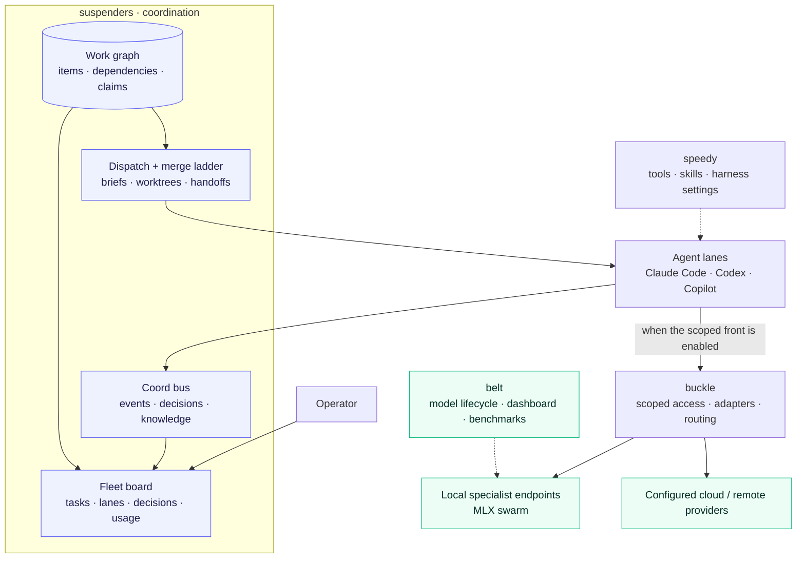
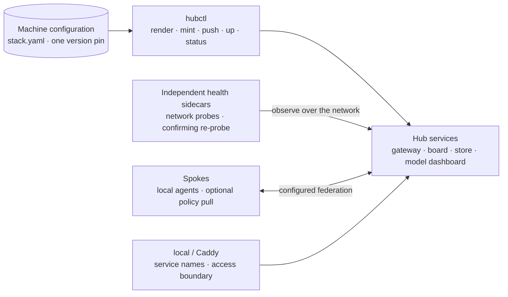

<div align="center">

# fleet

### The klh agent stack

**Give agents work. Keep them coordinated. Route their models. See what happened.**

One monorepo for the tools that turn individual coding agents into an operated fleet.

[Examples](#what-you-can-do-with-fleet) · [The stack](#the-stack) · [Architecture](#how-it-fits-together) · [Get started](#get-started) · [Benchmarks](benchmarks.md)

</div>

---

Fleet brings together the developer environment, agent control plane, LLM gateway,
local model fleet, service front, and failure benchmarks. Work has an identity,
lanes have claims and credentials, decisions reach the operator, and completed
items carry commit evidence.

Use it to coordinate coding agents on shared repositories, run specialist models
on an Apple Silicon Mac, or operate hubs with connected spokes. Local inference,
cloud providers, and federation are configurable parts of the stack.

> **Migration snapshot · 6 October 2026**
> All seven packages have workspace manifests and a root lockfile. The Suspenders
> installer now ships BLAM and verifies imports before restarting services.
> Hub Compose conversion and unified installation remain migration work.
> See [migration status](#migration-status) before deploying a new hub.

## What you can do with Fleet

### On one Mac: deliver a feature with several coding agents

You want pagination in an API, tests for edge cases and a matching UI. Register
the goal, split genuinely independent work into lanes and follow progress on the
board. Each lane works in its own worktree, carries a brief and checkpoints its
progress; the integration lane checks the changes together before landing them.

```sh
# Run from the project you want the agents to work on.
work add "Add pagination to the orders API" \
  --desc "Implement bounded paging, preserve existing response fields and test empty and final pages."
work ready
dispatch --dry-run --target 1
coord fleet
```

If two agents need the same file, the governor protects the current holder's
lease. A second unchanged conflict requests one targeted consultation rather
than generating a stream of identical requests. After the asker tests an answer,
verified knowledge can help the next lane facing the same scoped problem.
Use your registered lane ID and the consult ID returned by the first command:

```sh
coord consult --best "How does this API preserve cursor compatibility?" \
  --scope "src/api/orders" --as "$LANE_ID"
coord consult-reply "$CONSULT_ID" --feedback resolved \
  --evidence "Compatibility tests passed; existing cursors still work" --as "$LANE_ID"
coord kb stats
```

Use local MLX specialists for suitable extraction, reranking and coding tasks,
with configured cloud routes available for other work. The model supervisor
adopts running services, probes them and uses persistent restart budgets,
jittered backoff and dependency checks to recover from failures. A capsule lets
a replacement lane resume completed work after an agent process dies.

### With distributed hubs: use a remote gateway from a developer laptop

Your laptop runs the agent tools while a configured desktop or NAS hub provides
model access, a board or a shared coordination store. Keep each hub's addresses,
ports and credentials in machine configuration. A project can choose a configured
hub through its `.prefer` file; this selects the lane's gateway destination while
the agent process and checkout stay on the developer's machine.

```ini
# .prefer — LAB must exist in the operator's hub registry.
hub=LAB
```

```sh
# Set HUB to an existing profile in stack.yaml; these commands do not deploy it.
bun packages/suspenders/deploy/hubctl.ts render "$HUB"
bun packages/suspenders/deploy/hubctl.ts status "$HUB"
```

For example, a developer can use local specialists for small jobs and a remote
gateway for larger requests, while the gateway applies routing policy and
credentials. Independent health sidecars report network failures even when the
service they monitor is down. Existing configured installations support these
building blocks; the Compose template still needs conversion from legacy repo
origins and paths before a fresh monorepo hub deployment.

Sharing a coordination store requires matching project identity. Separate
developers' clones are not yet automatically one shared project. Automatic
governor consultations currently use the local lease registry; a spoke using a
different coordination hub also needs an outbox relay. Cross-hub lane visibility,
origin attribution and downstream filters are described in the
[federation architecture](docs/upstream-observability-architecture.md).

### In an enterprise: coordinate a shared service-health policy

A platform team wants every API to have an independent health reporter that
remains available when the API process stops. Fleet can carry the implementation
work: give agents the policy and acceptance criteria, register remediation items,
assign lanes, surface developer decisions and retain commit evidence. Reuse the
existing probe sidecar where it meets the service's deployment contract.

The intended enterprise workflow is to assess each service once per relevant
code/configuration version, share that assessment across authorized teams and
propose missing reporters to developers. An approved lane implements the change;
verification distinguishes a merged patch from a reporter actually deployed and
serving. Upstream hubs should show the downstream lanes they serve, with filters
that let platform operators inspect one team instead of every lane in the fleet.

**Available building blocks:** work tracking, agent guidance, consultations,
commit evidence, scoped gateway keys, independent probes and configured routing.
**Enterprise design work:** shared cross-clone project identity, tenant-aware
authorization, policy assessment/deduplication, approved knowledge sharing and
cross-hub observability. An `AGENTS.md` instruction supplies guidance; it does not
by itself enforce corporate policy. The private `fleet-remote` tier remains planned.

See the [health-policy scenario](toto-gpt.md#design-refinement-make-policy-a-shared-workflow-not-repeated-instructions),
[cross-hub project identity](docs/cross-hub-project-identity.md) and
[upstream observability architecture](docs/upstream-observability-architecture.md)
for the implementation boundaries and enterprise rollout design.

## The stack

| Package                                | Responsibility                     | What lives there                                                                                                                           |
| :------------------------------------- | :--------------------------------- | :----------------------------------------------------------------------------------------------------------------------------------------- |
| **[suspenders](packages/suspenders/)** | Coordinate the agents              | SQLite work graph, claims and leases, coordination bus, decisions, knowledge, hook gates, dispatch, merge ladder, fleet board, hub tooling |
| **[buckle](packages/buckle/)**         | Govern model access                | OpenAI and Anthropic API dialects, provider adapters, routing ladders, retries and cooldowns, scoped keys, usage accounting, federation    |
| **[belt](packages/belt/)**             | Operate the model fleet            | Specialist registry, MLX lifecycle and routing, dashboard, remote discovery, evaluation and benchmark tools                                |
| **[speedy](packages/speedy/)**         | Equip the developer environment    | CLI tools, curated skills, personas, hooks, settings, statusline, installation and harness configuration                                   |
| **[local](packages/local/)**           | Give services a local front        | Caddy registration, Bonjour/mDNS names, loopback defaults, authenticated LAN exposure, service registry and bar dashboard                  |
| **[local-llm](packages/local-llm/)**   | Run the shared inference runtime   | Extracted flat kit: resident-model supervisor, specialist registry, model spawner, Anthropic-wire router, and runtime config templates     |
| **[blam](packages/blam/)**             | Study and reproduce agent failures | CRASH taxonomy, sanitized incident dataset, deterministic benchmark scenarios, labeling tools, and the shared prompt-condense engine       |

The boundaries matter: **suspenders assigns and tracks work; buckle controls LLM
requests; belt operates the model fleet; speedy configures the agent environment.**
`local` supplies service access, while BLAM provides evidence about failure modes
and prompt transformations.

## How it fits together



This is a responsibility map. Runtime policy chooses the actual route: the
local router and LiteLLM remain part of existing installations, and dispatch
can fall back to belt directly when the buckle front or admin credential is
unavailable.

### From a goal to a commit

1. **Register the work.** The work graph holds the task, dependencies, priority,
   and executor preferences. Larger missions can split into independent items.
2. **Dispatch a lane.** A claim, worktree, brief, and resume context identify
   the work. Where configured, dispatch mints a revocable `bksk_` credential and
   routes through `/w/<sid>` for lane attribution.
3. **Coordinate as it runs.** WebSocket subscriptions carry events and
   consultations. Decisions and durable facts belong in the coordination plane.
4. **Check and integrate.** Hook gates enforce configured quality and edit
   rules; the merge ladder integrates branches. Closure records commit evidence,
   and reclaim verbs recover claims from dead lanes.

The board also exposes orchestration previews and prompt settings. Deterministic
condensing delegates to BLAM's canonical engine; optional model enhancement has
an unavailable-endpoint fallback.

### From one machine to hubs and spokes



Hub profiles supply ports, binds, origins, transport and secret paths. The
intended deployment unit is one pinned stack, pulled into named volumes.
Health comes from a separate probe process, with consecutive-miss handling and
an active confirmation before declaring a target down.

The current Compose template still pulls three legacy repositories and uses
their old directory layouts. Monorepo deployment conversion is pending; changing
the origin URL alone does not account for the new `packages/` paths.

## Get started

**Requirements depend on the layer.** TypeScript tools use Bun; the root
manifest declares Bun >=1.1. Developer installers and the local service front
target macOS. MLX inference requires Apple Silicon and enough memory for the
chosen model tier. Hub services use Docker Compose; consumers reach model
endpoints over HTTP.

### Explore and test the source

```sh
git clone https://github.com/klh/fleet.git
cd fleet

# Resolve the monorepo workspace from its root lockfile.
bun install --frozen-lockfile

# Focused checks of shared condensing, board transforms and lane credentials.
bun test packages/blam/test/condense.test.ts packages/suspenders/test/prompt-transform.test.ts packages/suspenders/test/lane-auth.test.ts

# Run the board from the checkout.
bun packages/suspenders/hooks/bin/fleet-board.ts
```

The board defaults to port **7799**. Package READMEs describe individual tools,
but some still contain pre-migration clone URLs and installation paths.

### Inspect the installer before activation

```sh
bash packages/suspenders/install.sh --dry-run
```

The current installer supports `--wire`, `--with-launchd`, `--skip-models`,
`--no-llm` and `--refresh-supervisor`, with `SUSPENDERS_PREFIX` and `SUSPENDERS_SHIM_BIN` overrides. Its
default path sets up a minimal local swarm and attempts model downloads.

The harness includes BLAM and checks the shared condenser import before service
activation. Launchd registration uses retries and per-job private diagnostics;
failed job loads make the install return an error. `--refresh-supervisor` updates
only an existing advanced belt supervisor's code, preserving runtime configuration.
This is a package installer; a unified installer for every Fleet service remains
migration work.

## Everyday operations

Once installed and wired, PATH shims expose the command surfaces.
Every verb has `--help`.

| Need                               | Command                                                                  |
| :--------------------------------- | :----------------------------------------------------------------------- |
| See claimable work                 | `work ready`                                                             |
| Inspect an item                    | `work show <id>`                                                         |
| Claim and close with evidence      | `work take <id> --as <sid>` / `work done <id> --as <sid> --sha <commit>` |
| Recover dead claims                | `work reclaim all`                                                       |
| See fleet activity                 | `coord fleet`                                                            |
| Subscribe to coordination events   | `coord subscribe --as <sid>`                                             |
| Retrieve a durable lesson          | `coord fact get lesson.<topic>`                                          |
| Dispatch work                      | `dispatch --help`                                                        |
| Render a hub profile's environment | `bun packages/suspenders/deploy/hubctl.ts render <hub>`                  |
| Inspect hub health                 | `bun packages/suspenders/deploy/hubctl.ts status <hub>`                  |

### Runtime configuration

Real hosts, credentials and organization-specific settings live outside the
repository. Committed configuration supplies examples and defaults.

| Location                                  | Purpose                                                     |
| :---------------------------------------- | :---------------------------------------------------------- |
| `~/.config/klh/stack.yaml`                | Hub profiles, deployment settings and the stack version pin |
| `~/.claude/local-llm/belt.env`            | Runtime provider settings and buckle admin credential       |
| `~/.claude/local-llm/hubs.json`           | Hub labels and candidate URLs                               |
| `~/.claude/local-llm/routing-policy.yaml` | Operator-owned routing ladder                               |
| `~/.claude/local-llm/upstreams.yaml`      | Runtime upstream group overrides                            |
| `~/.claude/local-llm/buckle-spoke.env`    | Spoke bootstrap credential                                  |

Keep secret-bearing files mode **0600**. Root keys are generated on the target
device; admin and lane keys are minted through the gateway API, audited and
revocable. Deployment profiles determine ports and exposure; example port
numbers in package docs are not universal settings.

## Engineering principles

- **One stack version.** The machine-level version pin selects the same ref
  across deployed services; release and workspace consolidation remain migration work.
- **One work ledger.** Tasks and claims belong in the work graph; docs explain
  architecture and decisions. Project identity follows the Git common directory.
- **Independent health.** Sidecars observe real network responses outside
  the served process.
- **Config over code.** Machine facts and secrets stay in runtime configuration.
- **Streams by default.** Streaming HTTP/SSE, NDJSON feeds and bounded rings keep
  asynchronous work from becoming unbounded buffers.
- **Quality at the edit boundary.** qlty is the quality surface, Biome owns code
  formatting, and Prettier owns Markdown. TypeScript files have a 1500-line limit.
- **Lit and design tokens.** Native elements first, vendored assets for offline
  use. Legacy board string rendering remains to be migrated to this standard.

## Evidence and benchmarks

[**benchmarks.md**](benchmarks.md) is the consolidated measurement table: model
serving, routing, stack-versus-direct API comparisons, and prompt transforms.
It distinguishes timing results from small-sample quality evidence. Raw belt
measurements live in [benchmarks.jsonl](packages/belt/bench/benchmarks.jsonl).

BLAM complements those measurements with the **CRASH** failure taxonomy:
Concurrency races, Recovery gaps, Alignment drift, State poisoning, and Handoff
failures. Core scenarios use scripted lane stand-ins, so control-plane failure
reproduction can run without model calls. See the
[taxonomy](packages/blam/docs/taxonomy.md) and [benchmark harness](packages/blam/bench/).

## Migration status

| Area                     | State in this checkout                                                                                |
| :----------------------- | :---------------------------------------------------------------------------------------------------- |
| Repository consolidation | Seven package directories are present; this is the destination for new changes                        |
| Shared inference package | Shared swarm kit is extracted into `local-llm`; the installer sources it from this package            |
| Workspace                | Root declares `packages/*`; all seven packages have manifests and `bun.lock` is present               |
| Installation             | Suspenders ships BLAM and verifies imports/launchd registration; a unified stack installer is pending |
| Hub deployment           | External probe sidecars are present; origins and execution paths still follow legacy repositories     |
| CI                       | Workflows are nested under packages; no root GitHub Actions workflow is present                       |
| Private tier             | `fleet-remote` is the planned separate enterprise monorepo, outside this checkout                     |

The work graph carries migration work, including the landed extraction (W422.4),
workspace wiring (W422.5), clean installation (W422.6), and deployment conversion
(W422.7). Consult the live graph for item status.

## Read further

- [Monorepo review](docs/monorepo-review-2026-10-05.md) — verified integration findings and validation limits.
- [Control plane](packages/suspenders/README.md) — work, coordination, dispatch and board surfaces.
- [Gateway](packages/buckle/README.md) — adapters, routing and governance.
- [Model fleet](packages/belt/README.md) — model roles, lifecycle and evaluation.
- [Developer environment](packages/speedy/README.md) and [local services](packages/local/README.md).
- [Hub deployment](packages/suspenders/deploy/README.md) and [example configuration](packages/suspenders/deploy/stack.example.yaml).
- [Local-LLM runtime](packages/local-llm/README.md) — kit layout, operation and provenance.

## Licensing

Licenses are package-specific. Buckle, speedy and BLAM code carry MIT licenses;
suspenders, belt and local carry Business Source License 1.1 files with
package-specific parameters. BLAM's dataset has a separate CC-BY-4.0 notice.
`local-llm` does not yet have its own license file. Consult each package's
`LICENSE` and applicable notices rather than assuming one license for the stack.

---

<div align="center">

A [Threads](https://www.threads.dk) thing.

</div>
