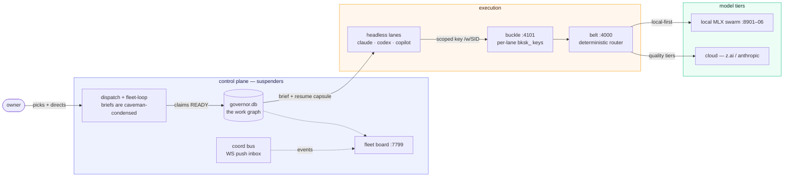
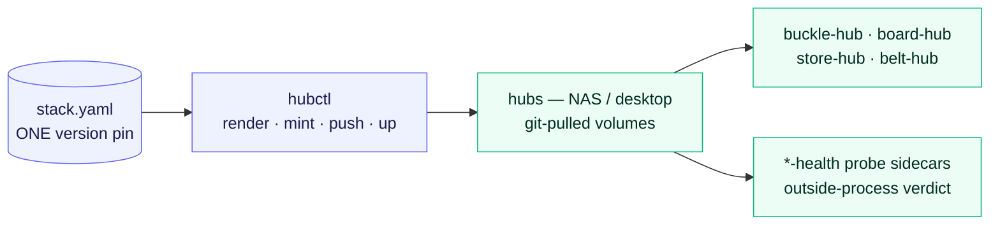

# fleet — the klh agent stack

One monorepo, one version, every service. The agent-fleet control plane:
governor work graph, coord bus, LLM gateway with per-lane credentials and
scoped keys, the local MLX swarm, and the hub deployment topology — all
versioned as ONE stack (`v2.0.0` tags ride every release of the whole).

## Packages

| package               | what it is                                                               |
| --------------------- | ------------------------------------------------------------------------ |
| `packages/suspenders` | the control plane: governor.db, coord bus, hooks/gates, dispatch, deploy |
| `packages/buckle`     | the LLM gateway: governance gate, scoped keys, routing, federation       |
| `packages/belt`       | the LLM fleet dashboard + gateway                                        |
| `packages/speedy`     | the config layer                                                         |
| `packages/local`      | the Caddy `.local` service front                                         |
| `packages/local-llm`  | the local MLX swarm kit (extraction in flight — W422.4)                  |
| `packages/blam`       | the benchmark: CRASH taxonomy, incident dataset, prompt-condense engine  |

The private `fleet-remote` monorepo (the paid enterprise tier) mirrors this
structure and DEPENDS on these packages — never copies.

## How work flows

Every write is gated (qlty/biome + content gates), every lane rides its own
revocable key, every closure carries a commit sha. Dead lanes are reclaimed;
capsules make any lane resumable by the next dispatch.

## How deploys flow

## Laws the stack runs on

- **One version**: `version:` in the machine-level stack config pins buckle +
  suspenders + belt; hubctl renders it as the git ref every hub pulls.
- **Config-over-code**: real hosts, keys, OIDC values live ONLY in
  machine-level runtime config (`~/.config/klh/stack.yaml`, `~/.claude/local-llm/*.env`,
  mode 600) — repos carry placeholders.
- **Health is outside-process**: a server cannot paint itself healthy. Every
  hub service gets a `*-health` probe sidecar that polls the real target
  over the network, serves the verdict on its own port, and actively
  re-probes before calling it unhealthy.
- **Secrets are minted, never typed**: root keys generated ON the target
  device (0600, idempotent), admin and per-lane `bksk_` keys minted via the
  gate's admin API, revocable, audited.
- **No host-path deploys**: hub containers mount git-pulled volumes, never
  dev checkouts.
- **Streams over buffers; one ledger (governor.db); 1500-line hard limit;
  Lit components; qlty/biome gates.**

## Ops quick reference

| Surface        | Where                                                                  |
| -------------- | ---------------------------------------------------------------------- |
| work graph     | `work ready · take · done --sha`                                       |
| coordination   | `coord subscribe · fleet · events`                                     |
| dispatch lanes | `dispatch` (headless, per-lane key)                                    |
| fleet board    | `*.local` :7799                                                        |
| LLM router     | belt :4000 → swarm :8901–06 / LiteLLM :4100                            |
| benchmarks     | [benchmarks.md](benchmarks.md) — the ONE table                         |
| install        | `bash install.sh` from packages/suspenders — the only repo→prefix sync |

## Status

The monorepo merge is in flight: history-preserving subtree merges are in,
the unified installer and workspace wiring (W422.4–.6) land next, then the
original repositories archive with pointers here.
