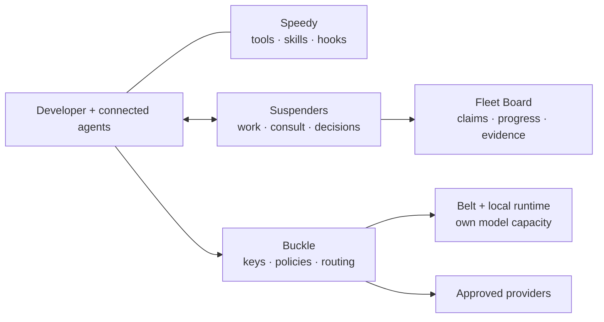

# Fleet

**Give agents work. Keep them coordinated. Route their models. See what happened.**

The klh agent stack brings coding agents, a shared work ledger, model routing,
local inference and operational visibility into one monorepo. Start on a developer
machine; connect configured hubs when you need shared services or model capacity.

[Get started](#get-started) · [Architecture](#the-stack) · [Agents together](#agents-working-together) · [Hubs](#machines-and-hubs) · [Documentation](#documentation)

## Why Fleet

- **Work survives the conversation.** Items, dependencies, claims, decisions and
  commit evidence remain in the work graph when an agent restarts.
- **Agents can ask each other.** Scoped consultations connect the right expert;
  tested answers become reusable knowledge with recorded feedback.
- **Choose the model separately from the work.** Buckle routes approved local and
  cloud endpoints through OpenAI and Anthropic client contracts, with scoped keys,
  budgets, retries, cooldowns and usage attribution.
- **Operate your own capacity.** Belt and the local runtime manage MLX specialists;
  API-compatible model servers can participate in the configured gateway pool.
- **See failures as well as activity.** The board shows work and decisions;
  independent health probes observe services outside their own processes.

## The stack

| Package | Purpose | Start here |
| --- | --- | --- |
| **Suspenders** | Work graph, claims, coordination, consultations, hooks, lanes, integration and Fleet Board | [Guide](packages/suspenders/README.md) |
| **Buckle** | Authenticated LLM gateway, provider adapters, routing ladders, budgets and federation | [Guide](packages/buckle/README.md) |
| **Belt** | Model inventory, lifecycle, routing, dashboard, discovery and evaluation | [Guide](packages/belt/README.md) |
| **Speedy** | Developer tools, skills, personas, hooks and harness settings | [Guide](packages/speedy/README.md) |
| **Local** | Caddy service front, local names, discovery and access configuration | [Guide](packages/local/README.md) |
| **Local LLM** | Shared inference runtime, model spawner, supervisor and memory policy | [Guide](packages/local-llm/README.md) |
| **BLAM** | Agent failure taxonomy, reproducible scenarios and prompt condensing | [Guide](packages/blam/README.md) |



**Suspenders governs work; Buckle governs model requests.** Belt operates model
capacity, Speedy equips agent environments, and Local exposes configured services.
A model endpoint and an agent harness are separate choices: tool execution still
belongs to the harness running the lane.

## Get started

Bun runs the TypeScript tools. Developer installers target macOS; local MLX
inference requires Apple Silicon and memory appropriate for the chosen models.
Hub services use Docker Compose. See each package guide for its prerequisites.

### Explore the checkout

```sh
git clone https://github.com/klh/fleet.git
cd fleet
bun install --frozen-lockfile

# Focused source checks; no model download or service activation.
bun test packages/blam/test/condense.test.ts packages/suspenders/test/prompt-transform.test.ts packages/suspenders/test/lane-auth.test.ts

# Inspect the installation plan before activating the local harness.
bash packages/suspenders/install.sh --dry-run
```

The [Suspenders installer](packages/suspenders/install.sh) supplies the local
harness and `work`, `coord` and `dispatch` shims. Read its options before
installation: the default setup can download models. Runtime configuration remains
on the machine. For board operation, start with the
[Suspenders guide](packages/suspenders/README.md).

### Register a goal and inspect the fleet

From the project checkout, with Fleet tools installed:

```sh
work add "Add bounded pagination to orders" --scope src/api/orders \
  --desc "Preserve response fields; test empty, final and oversized page requests."
work ready
work lanes --json
coord fleet
dispatch --dry-run --target 1
```

The preview launches nothing. Actual dispatch assigns a claim, an isolated
workspace and a brief; configured governed routes supply lane credentials. After
checks and a commit, the lane records evidence in the graph. Follow the
[full walkthrough](packages/suspenders/examples/walkthrough.md) for dependencies,
consultations, decisions and recovery.

## Agents working together

**The handoff is a work item, an owned scope and evidence.** Agents keep their own
conversations while sharing Fleet's coordination surface.

| Surface | A useful role | Connection to Fleet |
| --- | --- | --- |
| ChatGPT GUI | Refine the goal, acceptance criteria and tradeoffs | Transfer the brief to a connected local agent; web chat needs an explicit tool connection to operate Fleet directly |
| Codex desktop | Inspect the repository, implement a scope, review integration | Use installed Fleet tools in its authorized checkout; register a separate Fleet lane identity |
| Claude Code | Implement an independently owned change | Supported CLI executor with configured briefs, hooks and model routing |
| GitHub Copilot | Implement another owned scope or contract tests | Supported Copilot CLI executor; an editor chat participates through an explicit connected workflow |
| Fleet Board | Review claims, decisions, activity and evidence | Reads the same work and coordination state |

### Example: API, UI and contract tests

Agree the pagination contract in ChatGPT. Give Codex the API, Claude the UI, and
Copilot the contract tests. Register separate items and scopes; one integration
owner reviews the resulting commits together.

```sh
work add "Orders API: pagination" --scope src/api/orders \
  --desc "Implement the agreed cursor contract and bounded page size."
work add "Orders UI: pagination controls" --scope src/ui/orders \
  --desc "Use the API contract; preserve loading and empty states."
work add "Orders tests: paging boundaries" --scope test/orders \
  --desc "Verify empty, final and oversized page requests."
```

Use the actual IDs returned by `work add`. A connected agent registers its Fleet
identity and takes its item before editing:

```sh
SID="my-api-lane"  # Choose a unique identity for this session.
coord bootstrap --as "$SID" --name "Orders API" --role worker
work take "$API_ITEM" --as "$SID"

# After implementing, checking and committing:
work done "$API_ITEM" --as "$SID" --sha "$(git rev-parse HEAD)" \
  --summary "Implemented bounded cursor pagination, preserved existing response fields, and verified empty, final and oversized page requests."
```

The other lanes use their own identities and item IDs. Assignment across products
is an operator choice; automatic dispatch follows the configured executor
preferences and installed CLIs. It does not launch the Codex desktop interface.

### Ask once, verify, retain the answer

If the test lane needs clarification, it consults an expert rather than repeating
the investigation. Use the consult ID returned by the first command:

```sh
coord consult --best "Must existing order cursors remain valid?" \
  --scope src/api/orders --as "$SID"

# Once the answer has been received and tested:
coord consult-reply "$CONSULT_ID" --feedback resolved \
  --evidence "Compatibility tests passed for existing cursors" --as "$SID"
```

A question needing a human becomes a board-visible decision:

```sh
coord emit NEED_DECISION --to "$SID" --as "$SID" \
  --note "Cursor expiry: preserve indefinitely or set an explicit retention period?"
```

See the [lane protocol](packages/suspenders/AGENTS.md) for subscriptions, ownership,
checkpointing and completion. A product conversation ID is not a Fleet lane ID.

## Machines and hubs

**Local:** keep the agent, checkout and small specialist models on one machine.
Use the board to inspect work, and the gateway to select configured model routes.

**Distributed:** keep developer checkouts local while a hub supplies approved
model access, a board or coordination services. A registered hub can expose both
cloud routes and your own API-compatible inference servers. Routing configuration
controls where a request goes; cloud-routed requests reach the selected provider.

```ini
# Project .prefer — LAB must exist in the operator's hub registry.
hub=LAB
```

```sh
# HUB names an existing profile in machine-level stack.yaml.
bun packages/suspenders/deploy/hubctl.ts render "$HUB"
bun packages/suspenders/deploy/hubctl.ts status "$HUB"
```

**Enterprise:** scoped gateway credentials, budgets, signed gateway manifests,
repository-policy evaluation and independent health probes provide building blocks
for governed downstream work. A service-health assessment can produce an actionable
question, an approved remediation item and implementation/deployment evidence.
An agent instruction alone does not enforce a corporate policy.

Read the [health/status contract](docs/health-status-contract.md),
[cross-hub identity design](docs/cross-hub-project-identity.md) and
[upstream observability design](docs/upstream-observability-architecture.md) before
planning shared project identity, inherited agent policies or multi-hub reporting.
Separate clones require explicit identity/authorization design.

## Operating principles

- **One work ledger:** use the graph for tasks and claims; documentation describes
  contracts and decisions. Local project identity follows the Git common directory.
- **One version per release:** a release is one git tag (`v2.0.0` style); every
  `packages/*` manifest carries that version and the
  [changelog](CHANGELOG.md) records the release line. The `version:` pin in
  machine-level `stack.yaml` names the same ref — hubctl renders it as the ref
  every hub pulls.
- **Independent health:** a separate process probes the real target over the network.
  A listening gateway alone does not prove a model can execute tools.
- **Config over code:** hub profiles and version pins live in
  `~/.config/klh/stack.yaml`; provider settings and routing overrides live in the
  configured runtime home. Secret-bearing files are mode 0600.
- **Mint and retire credentials:** bootstrap keys originate on the target device;
  scoped gateway keys are audited and revocable.
- **Quality at the edit boundary:** qlty is the quality surface; Biome formats code,
  Prettier formats Markdown, and TypeScript files stay below 1500 lines.
- **Bounded recovery:** inspect dead claims and evidence before resuming; repeated
  failures need diagnosis rather than an unlimited restart loop.

**Deployment note:** this monorepo is the destination for new changes. Some package
instructions and the hub Compose template still reference legacy repositories or
paths; check the [deployment guide](packages/suspenders/deploy/README.md) and live
work graph before a fresh hub installation.

## Documentation

| I want to… | Read |
| --- | --- |
| Run a lane and hand off work | [Walkthrough](packages/suspenders/examples/walkthrough.md) · [Lane protocol](packages/suspenders/AGENTS.md) |
| Operate work, decisions and the board | [Suspenders](packages/suspenders/README.md) · [GUI/observability review](docs/gui-observability-review.md) |
| Configure models, keys and routing | [Buckle](packages/buckle/README.md) · [Belt](packages/belt/README.md) |
| Use local inference or several machines | [Runtime](packages/local-llm/README.md) · [Multi-machine guide](packages/belt/docs/multi-machine.md) |
| Install tools, skills and the service front | [Speedy](packages/speedy/README.md) · [Local](packages/local/README.md) |
| Configure a hub | [Deployment](packages/suspenders/deploy/README.md) · [Profile template](packages/suspenders/deploy/stack.example.yaml) |
| Understand health and federation | [Health contract](docs/health-status-contract.md) · [Project identity](docs/cross-hub-project-identity.md) · [Upstream observability](docs/upstream-observability-architecture.md) |
| Evaluate performance and failure modes | [Measurements](benchmarks.md) · [BLAM taxonomy](packages/blam/docs/taxonomy.md) |
| Understand consolidation findings | [Monorepo review](docs/monorepo-review-2026-10-05.md) |
| Track stack releases | [Changelog](CHANGELOG.md) |

## License

Each package carries its own Business Source License 1.1 and notices; consult the
package `LICENSE` for terms, including its declared Change Date. BLAM's dataset
has a separate CC-BY-4.0 notice. This repository is not a blanket open-source grant.

---

A [Threads](http://www.threads.dk) thing.
