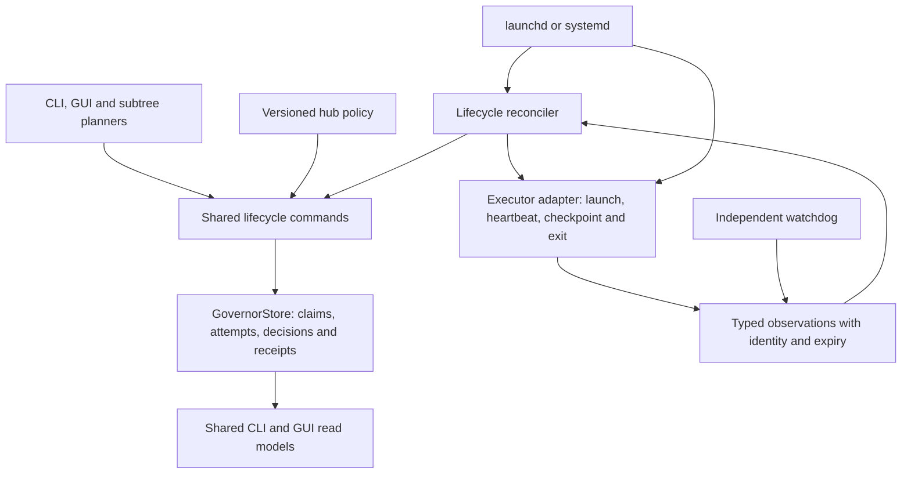

# Fleet control chain: architectural review

Reviewed 2026-10-07 against source revision `825f90bbf544067d53619afbe21d8b68050b8484`. This is a source review and primary-documentation comparison; it does not establish which revision each running daemon has loaded. Work ledger: W576. Existing W572 and W573 address important subsets.

## Verdict

The recent safety repairs are useful, but Fleet has accumulated overlapping control mechanisms. Several components independently decide whether a lane is alive, whether ownership should change, and whether another executor should start. Fixing one path does not constrain the others. The architectural remedy is fewer mutation authorities and shared transition contracts.

## Verified source findings

| Finding | Evidence | Consequence |
| --- | --- | --- |
| Three launch implementations | `scripts/dispatch-next.ts:887-1045`; `hooks/bin/fleet-loop.ts:845-1163`; `scripts/supervise.ts:273-355` | Admission, credentials, registration and cleanup can diverge. `supervise` uses inherited `laneEnv` and direct `spawnClaude`; it does not use dispatch-next's governed-key decision/preflight. |
| Conflicting liveness contracts | `scripts/supervise.ts:429-431` uses worktree cwd; `hooks/lib/lane-liveness.ts:167-201` distinguishes exact process identity from unknown; `hooks/bin/monitor.ts:52-104` closes sessions from stale heartbeat plus filename-based transcript checks | A component can classify work as dead while another treats its executor as live or unknown. A cwd is location evidence, not progress. |
| Recovery remains distributed after W573 | `hooks/bin/fleet-loop.ts:588-724` uses scoped recovery; `hooks/bin/monitor.ts:572-603` invokes unpinned per-item reclaim; `hooks/lib/quota-sweep.ts:362-379` invokes per-item reclaim independently | Monitor/quota recovery does not use the new owner/revision observation or durable recovery budget. A verb's internal CAS protects its own fresh read, not an earlier observer's old owner/death decision. |
| Retry ownership is split | `scripts/dispatch-next.ts:698-705,1067-1071` records lane launch attempts; `scripts/supervise.ts:444-463` records journal resumes; `hooks/lib/dead-claim-recovery.ts:79-110` records item recovery attempts | Switching entrypoints or reclaim mechanisms can bypass the intended total execution budget. Infrastructure retries and logical work attempts need separate, explicit limits. |
| Watchdog mixes observation with deployment and process destruction | `scripts/dispatch-watchdog.ts:65-86,289-309` compares mutable checkout bytes and invokes installer repair; `:231-244,402-418` selects processes by ports and kills them | Legitimate checkout edits can look like deployment drift. Emergency memory action lacks the same ownership, active-request and cooldown contract as normal resource admission. |
| Aggregate healthy exit omits several observations | `scripts/dispatch-watchdog.ts:430` returns only parity and lane-probe success | Missing service activation evidence, degraded supervised services or stalled graph can coexist with exit zero. Verdict dimensions should remain visible and aggregate through an explicit policy. |
| Enforcement outage behavior differs by boundary | `hooks/gates/governor.ts:105-111` continues with no DB; dispatch-next governed-key failures refuse | Strict model routing does not imply strict file/claim enforcement. Availability versus refusal must be an explicit policy choice with an auditable degraded outcome. |
| A same-owner renewal can lose a file lease | `hooks/gates/governor.ts:126-133` selects timestamp but deletes by path/owner only | Concurrent renewal by the same owner can be deleted from an older expiry observation. Use an observed revision/timestamp predicate and one shared lease transition. |

These findings describe executable source paths. Whether a particular path is currently invoked is a separate runtime question. For example, monitor's zombie reclaim is project-scoped and defaults to seven days; a cwd-less invocation can leave it inactive. That reduces immediate exposure, but does not make its contract consistent with W573.

## What established systems do

| System | Documented pattern | Fleet application |
| --- | --- | --- |
| [Temporal tasks](https://docs.temporal.io/tasks) and [retry policies](https://docs.temporal.io/encyclopedia/retry-policies) | Service-owned task dispatch/retry; workflow history replay; activity heartbeats can carry checkpoint data. Retry policy separates delay, attempts, total timeouts and non-retryable failures. | Persist the logical attempt before execution, classify failure, carry a checkpoint, and resume the failed operation. Configure finite time/cost/attempt limits: Temporal activity defaults are unlimited, so copying defaults would not solve Fleet's poison-work problem. |
| [Kubernetes controllers](https://kubernetes.io/docs/concepts/architecture/controller/) and [leases](https://kubernetes.io/docs/concepts/architecture/leases/) | Controllers reconcile desired and observed state through the API. Leases support heartbeats and leader election. | A reconciler owns a resource transition; other observers submit evidence. Controller leadership and per-attempt fencing are different responsibilities. A lease alone does not prevent an expired holder from making external writes. |
| [Nomad restart](https://developer.hashicorp.com/nomad/docs/job-specification/restart) and [reschedule](https://developer.hashicorp.com/nomad/docs/job-specification/reschedule) | Local task restart and allocation rescheduling are distinct policies; limits and backoff are explicit. Service rescheduling can be unlimited by default. | Distinguish restarting a gateway process from retrying an agent's work item. Keep model/provider failure from consuming or resetting unrelated work retry counts. |
| [LangGraph persistence](https://docs.langchain.com/oss/javascript/langgraph/persistence) and [interrupts](https://docs.langchain.com/oss/javascript/langgraph/interrupts) | Persistent thread checkpoints and explicit pause/resume inputs. Resuming an interrupted node reruns its pre-interrupt code. | Store WAITING_DECISION as durable execution state; CLI and GUI answer the same decision ID. Keep side effects out of replayed prefixes or protect them with stable idempotency keys. |
| [Ray actor fault tolerance](https://docs.ray.io/en/latest/ray-core/fault_tolerance/actors.html) | Actor restarts and task retries have separate limits. Unavailable differs from confirmed dead; application state requires checkpointing. Retried methods may execute twice. | UNKNOWN must hold, not authorize replacement. Restarting a process does not restore its work or make side effects exactly once. |
| [OPA agent tool calling](https://www.openpolicyagent.org/docs/agent-tool-calling) | A policy decision point evaluates structured tool name/parameters; the harness enforces before execution. Policy bundles can update independently, with decision logs. | Hub rules should produce structured allow/deny/ask outcomes at execution boundaries, with policy version and reasons. Prompt injection of a rule is guidance, not the enforcement mechanism. |

These systems solve different layers. None provides automatic proof that agent code is correct, tests passed, or an external side effect happened exactly once. Fleet's verified completion evidence remains necessary.

## Recommended ownership

1. **Governor** owns authorization and atomic resource/claim transitions. Structured decisions contain policy version, project, work item, attempt generation, principal, operation, evidence expiry and allow/deny/ask outcome. Revalidate authority when committing a protected operation.
2. **Lifecycle reconciler** owns work scheduling and recovery through those commands. Multiple instances are possible; scope leases and transactional generation checks fence conflicting actions. Subtree supervisors choose work but call the same launch API.
3. **Executor adapters** own the process lifecycle and typed telemetry. Local/remote host identity, process birth and attempt nonce are recorded before executable work can escape registration. Missing evidence is UNKNOWN. Transcript/log activity is diagnostic context, not completion.
4. **OS service manager** restarts infrastructure processes. Those restarts do not clear logical item attempt budgets or approval state.
5. **Watchdog** observes independently and publishes findings. Deployment reconciliation belongs to the canonical installer/activation controller. Emergency resource shedding is a separate explicit actuator with verified service identity, bounded retry/cooldown, active-request handling and a recorded action receipt.

A shared lifecycle record should persist project/item, attempt ID and generation, owner, executor/host identity, policy version, claim revision, heartbeat/checkpoint, next eligible retry time, launch/recovery budgets, decision ID and completion evidence. Use the existing authoritative store; do not add another JSON ledger. Logs and board caches are projections.

Keep work state, executor state and service health separate. A work item can be waiting for a person while its process is stopped; a process can be alive while work is stalled; a service can respond while structured tool execution is broken. Collapsing these into one green/red flag recreates the present ambiguity.

## Migration and acceptance

This review recommends consolidation in the current TypeScript/GovernorStore stack first. Adopting Temporal as a runtime would be a separate decision, requiring a real harness migration and deployment evaluation. LangGraph is useful for an agent's internal resumable graph, but does not replace Fleet's cross-harness ownership authority. Kubernetes/Nomad would govern compute placement, not the completion of repository work.

W572 should complete pre-exec launch fencing. W573 provides scoped, bounded dead-owner recovery. W576 then migrates all other mutation entrypoints to those shared contracts and removes their independent lifecycle decisions.

Acceptance must exercise actual isolated processes and shared storage: two simultaneous supervisors, crash before/after registration, uncertain/remote process evidence, same-owner lease renewal, owner transfer during grace, decision wait across restart, duplicate tool-result delivery, exhausted budget through every entrypoint, and controller failover. Assert one authorized launch/transition, no stale owner write, preserved uncommitted work, no budget reset, and one recorded terminal outcome. No production daemon restarts are part of this review.
