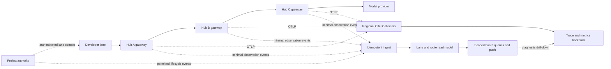

# Upstream lane visibility: standards research and recommended architecture

Research date: 5 October 2026. Fleet source baseline: `189feef`.

## Decision

Use standard request tracing and telemetry collection around a Fleet-specific
lane read model. Keep authoritative work state separate. Recommended components:
W3C Trace Context, OpenTelemetry/OTLP and regional Collector gateways; an
unsampled, idempotent stream of minimal lane/route observations; authenticated
query projections for the board; bounded-cardinality metrics; and a durable
usage ledger whose records are not inferred from sampled traces.

This recommendation is an architectural synthesis for Fleet, not an industry
standard for agent lanes or a benchmark-proven capacity claim. The underlying
gateway/tracing/federation patterns are established; their integration with
Fleet's work graph and lane lifecycle remains custom.

## Which parts are standard?

| Requirement                                  | Established mechanism                                            | What Fleet still defines                                         |
| :------------------------------------------- | :--------------------------------------------------------------- | :--------------------------------------------------------------- |
| Correlate a request through several gateways | W3C `traceparent` and `tracestate`, HTTP client/server spans     | Lane/project identity and trusted attribution                    |
| Collect from many machines/regions           | OTel agent and gateway Collector deployment patterns             | Which hubs may expose which lane metadata                        |
| Summarize downstream operations              | Aggregated metrics, including Prometheus hierarchical federation | Distinct lane counts and paginated lane detail                   |
| Identify replayed events                     | CloudEvents source/event identity                                | Observation schema, state transitions and consumer deduplication |
| Show current lane/work state                 | An application read model derived from domain events             | Lifecycle authority, freshness and UI access rules               |
| Bound trust across organizations/hubs        | Authenticated peers and delegated scopes                         | Enrollment, permissions and visibility policy                    |

W3C Trace Context standardizes request correlation across services. Envoy is a
concrete gateway implementation: its tracing documentation describes propagation
and hop-level spans. Reuse those conventions rather than inventing a growing
route-chain header. A trace ID is a correlation identifier, not a project ID,
lane ID, credential or work-ownership token.
[W3C Trace Context](https://www.w3.org/TR/trace-context/),
[Envoy tracing](https://www.envoyproxy.io/docs/envoy/latest/intro/arch_overview/observability/tracing).

OTel documents collectors running near applications and as shared gateways,
typically per cluster, data center or region. Collector placement is independent
of model traffic routing: telemetry can go to regional endpoints without
replaying through every LLM hub.
[OTel agent deployment](https://opentelemetry.io/docs/collector/deploy/agent/),
[OTel gateway deployment](https://opentelemetry.io/docs/collector/deploy/gateway/).

Prometheus hierarchical federation collects selected aggregated time series from
subordinate servers. That matches downstream summaries, but is not a registry or
event history of every lane. Its naming guidance warns against unbounded labels.
Do not attach unique lane/request/trace IDs to general-purpose metric families.
[Prometheus federation](https://prometheus.io/docs/prometheus/latest/federation/),
[Prometheus metric cardinality](https://prometheus.io/docs/practices/naming/).

## Compare plausible approaches

| Approach                                             | Strength                                                   | Limitation                                                                               | Decision for Fleet                                                      |
| :--------------------------------------------------- | :--------------------------------------------------------- | :--------------------------------------------------------------------------------------- | :---------------------------------------------------------------------- |
| Replicate every downstream work graph upward         | Complete local copy of work                                | Coupled ownership, permissions, migrations and fan-out; traffic does not imply authority | Reject as the default visibility mechanism                              |
| Hierarchical metrics alone                           | Efficient aggregate operations view                        | Cannot enumerate lanes or prove lifecycle; per-lane labels explode cardinality           | Use for summaries/alerts only                                           |
| Trace backend alone                                  | Standard multi-hop diagnostics and latency attribution     | Sampling, delayed export and open streaming spans make live lane completeness unreliable | Use for diagnostics only                                                |
| Full service mesh rollout                            | Mature network identity, routing and telemetry integration | Introduces substantial infrastructure and does not model Fleet work/lane semantics       | Integrate when the corporation already has it; not a Fleet prerequisite |
| OTel plus minimal lane observations and a read model | Standard diagnostics plus accurate scoped live inventory   | Requires a small custom schema, projection and replay contract                           | Recommended                                                             |

Istio treats networks, clusters, trust, tenancy and control-plane placement as
separate deployment dimensions. That supports separating Fleet's traffic hubs
from project authority and visibility scopes; it does not require adopting
Istio's Kubernetes deployment model for Fleet's current machines.
[Istio deployment models](https://istio.io/latest/docs/ops/deployment/deployment-models/).

## Recommended architecture



These can be logical modules rather than one new service for every box. A small
deployment can host query projection/ingest beside the board and retain local
outboxes. Large enterprises can partition projection and collection by region
and tenant. Residency determines where evidence lives and which summaries may
cross regions; the model route is not the telemetry residency policy.

### 1. Trusted identity, with standard correlation

Reuse Fleet's enrolled tenant/project/lane/executor identities from the
[identity design](cross-hub-project-identity.md). At the first managed gateway,
bind lane attribution to authenticated credentials or an authorized registration.
Verify the downstream peer at each further hub and propagate only permitted
identity. Keep origin hub separate from the authenticated immediate peer.

Use `traceparent` for each logical model request with child HTTP spans per hop
and outbound attempt. A lane produces many request traces; do not keep one trace
open for an entire multi-day lane. Retain Fleet request ID alongside trace ID and
assign distinct retry-attempt identities. OTel HTTP conventions include resend
ordinals for repeated HTTP client requests.
[OTel HTTP retry spans](https://opentelemetry.io/docs/specs/semconv/http/http-spans/).

Proposed custom span attributes include `fleet.lane.id`, `fleet.project.id`,
`fleet.hub.id`, `fleet.origin.hub.id` and `fleet.peer.hub.id`. These are Fleet
extensions, not standardized OTel names. Put observer hub/service/instance on
resource metadata; request-specific lane fields on spans/events.

Allowlisted W3C baggage may carry non-sensitive correlation hints between trusted
hubs, but cannot grant permissions. Strip private baggage at external-provider
egress. W3C explicitly warns about sensitive baggage crossing trust boundaries.
Credentials travel through the authentication contract, never baggage, prompts
or a public trace field.
[W3C Baggage](https://www.w3.org/TR/baggage/).

For enterprise service identity, reuse corporate mTLS/workload identity where
available. SPIFFE defines workload identities and verifiable identity documents;
OAuth token exchange defines delegation/impersonation mechanisms. These are
options for the peer/delegation boundary, not mandatory new infrastructure.
Use audience-bound, short-lived delegated credentials and validate project/lane
scope in Fleet; transport identity alone does not authorize all projects.
[SPIFFE overview](https://spiffe.io/docs/latest/spiffe-about/overview/),
[OAuth token exchange, RFC 8693](https://www.rfc-editor.org/rfc/rfc8693.html).

### 2. Unsampled observations for lane visibility

Publish minimal admitted/request-started/request-ended observations independently
of trace sampling. Coalesce safe high-frequency last-seen updates, but keep active
request transitions and accounting identities consistent. Authority publishes
lane lifecycle separately under its own provenance.

Suggested observation fields, a proposal rather than an existing Fleet API:

```text
event source/id/schema version; observer boot ID + sequence
tenant/project/lane/dispatch attempt IDs
request ID; outbound attempt ID; trace/span correlation
observer hub; authenticated peer hub; verified origin hub
observed event type; source time; ingest time; outcome
permitted model/usage metadata; completeness/freshness evidence
```

CloudEvents 1.0.2 supplies a portable event envelope and treats equal `source`
and `id` as duplicate events. Adopt that convention where useful; CloudEvents
does not provide persistence, ordering, exactly-once processing or authorization.
Keep payload field naming independent of CloudEvents extension constraints.
[CloudEvents specification](https://github.com/cloudevents/spec/blob/v1.0.2/cloudevents/spec.md).

Deduplicate event delivery transactionally before updating counters. Track source
sequence/boot identity to detect gaps and handle restart; do not use wall-clock
ordering alone. Reconcile active-request projection after crashes rather than
leaving streams permanently active. Expired observer evidence is unknown/stale,
not proof that the authoritative lane ended. A restarted observer may report a
new epoch without changing the global lane identity.

### 3. Regional query projections and bounded UI fan-out

Keep separate projected tables for permitted lane descriptors, per-observer lane
presence and request edges. A visibility edge proves only that hub H observed
lane L through peer P during a defined interval. Join lifecycle only when the
viewer can access authoritative state. Avoid full work-graph replication.

Default each upstream view to immediate downstream groups, with an origin filter
and project/time/error filters. Return distinct-lane counts within the selected
scope: origin and peer groups may overlap, so group counts are not necessarily
additive. Expose direct observations separately from globally authorized fleet
directory results. Enrich task titles on demand under project permissions.

Serve cursor-paginated detail and authenticated, server-filtered push updates.
Snapshot plus sequence/cursor reconciliation prevents the race between initial
load and subscription. Bound slow-client queues; send an explicit resync signal
when replay is no longer available. Permission changes invalidate affected
subscriptions and cached counts as well as detail access. Lit renders grouped
views using existing tokens; browser filtering is not an authorization mechanism.

For a shared enterprise projection, PostgreSQL is a reasonable initial candidate
for transactional deduplication, indexes and tenant-scoped queries. Row-level
security can provide defense in depth, but owners and privileged roles may
bypass it; use constrained application roles and test the actual query path.
Do not migrate the entire work graph just to introduce an observational read
model. A single-node pilot may retain SQLite under one writer behind the same
service contract; choose capacity upgrades from measured load.
[PostgreSQL row security](https://www.postgresql.org/docs/current/ddl-rowsecurity.html).

### 4. Use telemetry backends for their intended signals

Metrics describe request rate, errors, stream concurrency, latency, queue health
and collector losses with budgeted label combinations. Hub/peer/model dimensions
must still be bounded and evaluated for product cardinality. Tenant/project
detail can live in the query projection where unrestricted metric labels would
be expensive. Traces/logs hold request/lane identifiers for diagnostics.

An OTel Collector is a pipeline, not the lane database or visualization backend.
Reuse the enterprise's trace/metric backends; select a new backend only if absent.
Do not claim trace search automatically provides the complete live lane list.

Start with straightforward Collector gateways. Tail sampling is optional and
stateful: when introduced, route all spans of a trace to the same processing
instance. OTel describes trace-aware load balancing for this purpose and warns
that stateful components scale differently. Preserve unique writers for metric
streams; multiple collectors must not publish conflicting copies under the same
series identity.
[OTel Collector scaling](https://opentelemetry.io/docs/collector/scaling/),
[OTel gateway routing and metric writers](https://opentelemetry.io/docs/collector/deploy/gateway/).

GenAI conventions can enrich model/agent calls, but current agent-span conventions
are marked Development and have moved to a separate repository. Pin the selected
version and document mappings. `gen_ai.agent.id` describes a stable agent resource;
do not automatically assign a transient Fleet lane ID to it. Keep Fleet lane and
harness conversation identities explicit. Prompt/content capture stays opt-in.
[OTel GenAI agent conventions](https://github.com/open-telemetry/semantic-conventions-genai/blob/main/docs/gen-ai/gen-ai-agent-spans.md).

### 5. Resilience and accounting have different requirements

Telemetry export runs asynchronously with bounded queues and explicit loss
metrics; collector failure should not hang ordinary inference traffic. Configure
persistent Collector exporter queues where restart loss matters. OTel documents
remaining loss modes such as full queues, retry exhaustion and disk failure, so
do not equate a persistent telemetry queue with a durable accounting ledger.
[OTel Collector resiliency](https://opentelemetry.io/docs/collector/resiliency/).

For minimal lane events, start with a durable outbox and idempotent batch ingest
under an explicit overflow/recovery policy. Local persistence must be bounded and
cannot be called durable beyond its failure domain. Add a shared event broker
when replay, independent consumers or sustained inter-region outages justify it.
NATS JetStream is one candidate: its consumers support at-least-once delivery and
redelivery, so consumers still need idempotent projection writes. Broker acks do
not make an external database update atomic with message consumption.
[NATS JetStream consumer semantics](https://raw.githubusercontent.com/nats-io/nats.docs/master/nats-concepts/jetstream/consumers.md).

Keep billing/usage records on a separate reliable path. Designate which observer
reports provider usage for each actual provider attempt; preserve retries that
incur real spend. Gateways on the same request path must not each bill the same
token report. Missing final stream usage is unknown until reconciled, not zero.
Budget/admission enforcement is synchronous policy logic where required; a
sampled, delayed dashboard cannot enforce a global budget correctly.

## Fleet integration points verified in source

- `buckle/src/citizenship.ts` and `handlers.ts`: local `/w/<slug>` attribution
  exists but is stripped for upstream routing. Preserve a separate verified lane
  context through forwarding; do not overload the URL prefix as trust.
- `buckle/src/router.ts`: outbound attempts and fallback selection are span/event
  boundaries. `wire.ts` builds headers through provider adapters, so propagation
  must be wired and tested there, including bridges and managed-hub targets.
- `buckle/src/ledger.ts`: local lane/request audit is a useful observation anchor;
  keep accounting and projection contracts distinct from diagnostic exports.
- `buckle/src/gov/federation.ts`: authenticated spoke requests and signed policy
  manifests already exist. Reuse relevant enrollment/signing primitives rather
  than claiming Fleet has no federation; these mechanisms do not yet prove lane
  attribution, live observations or cross-hub project identity.
- `suspenders/scripts/dispatch-next.ts`: named hub redirects bypass its local
  buckle attribution setup. Test those paths explicitly with native harnesses.
- Board routes/read models: add scoped projection queries and filtered push;
  retain the project authority as the source for work ownership.

The inspected TypeScript directories had no search matches for `traceparent`,
`tracestate`, `baggage`, `opentelemetry`, `OTLP`, `CloudEvent` or `jetstream`.
That is a scoped source search, not proof that no deployment-level telemetry
integration exists. Bun/native harness compatibility with instrumentation and
stream lifetimes must be proven rather than assumed from Node.js examples.

## Rollout and measurable acceptance

1. Enroll stable project/lane/peer IDs; establish one work authority and an
   explicit trusted attribution contract.
2. Instrument A -> B -> C: standard HTTP trace propagation, verified origin/peer,
   separate retry spans and streaming request boundaries. Redact provider egress.
3. Add unsampled minimal observations, idempotent ingest and one scoped projection.
   Start with a single writer and durable replay before introducing a broker.
4. Ship grouped board queries, bounded push and trace drill-down. Avoid a full
   frontend rewrite or work-graph migration for this visibility feature.
5. Exercise overload/outage/replay; add regional partitioning, HA storage or broker
   only when the measured requirements call for them.

Set benchmark inputs before implementation: hub/tenant counts, admitted logical
requests per second, retries, concurrent streams, lane churn, browser viewers,
retention and maximum disconnected duration. Measure added request latency,
CPU/memory/disk per hub, projection lag, event gaps, replay time, export losses,
metric-series count and UI payload rate. No numeric capacity promise is made here.

Acceptance scenarios: trace and identity survive dialect bridges; A -> B -> C
changes to A -> C; lane uses multiple paths; retries do not duplicate lanes;
stream outlives the usual trace-export delay; all diagnostic traces are sampled
away but lane visibility still works; collector fails; outbox fills; observer
crashes with open streams; consumer replays duplicates; a tenant forges baggage;
viewer permission is revoked; provider usage is absent or replayed. Each failure
must retain truthful completeness/accounting status and bounded resource use.

No runtime components were installed, implemented or benchmarked by this research.
