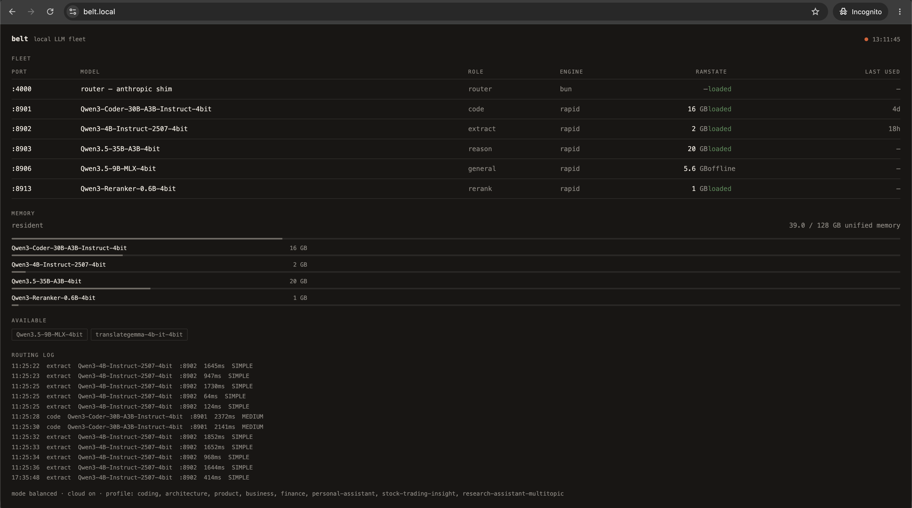

# belt

> Part of the klh fleet monorepo — the system overview (packages, flow
> diagrams, laws, ops) lives at the fleet root: [README.md](../../README.md).


> **Platform: Apple-silicon macOS.** belt runs MLX, which has no CUDA/ROCm path — the swarm needs an M-series Mac. Other machines and fleets can still consume it over the network: the endpoints are plain HTTP on :8901+.

**The local LLM fleet for your agent fleet.** A swarm of MLX specialists on
localhost — code, extract, reason, rerank — behind a deterministic keyword
router, with a benchmark rig that logs every measurement to `benchmarks.jsonl`.
Wear with [suspenders](https://github.com/klh/suspenders).

Five parallel Claude Code lanes hit `:8901` at once. Nobody waits on a remote
round-trip for a 4-line extraction, and nobody notices the cloud is down.

## The fleet

Single source of truth: [`bin/registry.ts`](bin/registry.ts) — port↔model pairs
exist only there. `swarm.ts` (lifecycle) and `router-shim.ts` (routing) both
import it; change a model in the registry and both follow.

| Port | Role                     | Model                                                                    | RAM         | Tier      | Engine    |
| ---- | ------------------------ | ------------------------------------------------------------------------ | ----------- | --------- | --------- |
| 8901 | ⚡ code                  | Qwen3-Coder-30B-A3B-Instruct-4bit                                        | 18 GB       | resident  | rapid-mlx |
| 8902 | 🏠 extract               | Qwen3-4B-Instruct-2507-4bit                                              | 2.5 GB      | resident  | rapid-mlx |
| 8903 | 🧠 reason                | Qwen3.5-35B-A3B-4bit                                                     | 20 GB       | resident  | rapid-mlx |
| 8906 | 🌐 danish/general        | Qwen3.5-9B-MLX-4bit                                                      | 5 GB        | on-demand | rapid-mlx |
| 8913 | 🔀 rerank                | Qwen3-Reranker-0.6B-4bit                                                 | 0.5 GB      | resident  | rapid-mlx |
| 8912 | 🗂 kev (typed classifier) | `jaredpalmer/kev-4b` via [~/dev/kev](https://github.com/jaredpalmer/kev) | ~8 GB       | resident  | external  |

Embeddings retired from the swarm (2026-09-23): `mlx_lm` 0.31.x dropped the
routes; embeddings live on `:8907` via context-rag's `embed_server.py`, started
on demand.

## Install

Requires macOS on Apple Silicon, [Bun](https://bun.sh), and ~64 GB of unified
memory headroom for the resident tier (M5 Max 128 GB measured). Small machines
take the minimal tier instead — see below.

```bash
git clone https://github.com/klh/belt && cd belt
./install.sh                      # deploy bin/ to ~/.claude/local-llm/ (full tier)
./install.sh --tier minimal       # small machines: resident fleet ≤4GB (:8902 extract + :8913 rerank)
./install.sh --with-models        # + deps (uv/mlx-lm/rapid-mlx) + model weights (~40-60 GB)
./install.sh --with-launchd       # + KeepAlive agents (com.belt.swarm, com.belt.kev, per-port rapid servers)
```

**Tiers.** `BELT_TIER` (or `--tier minimal|full` at install time) scopes the
resident fleet — `full` (default) keeps every resident specialist, `minimal`
keeps only models ≤4 GB (extract :8902, rerank :8913): the fleet a 16 GB
machine holds. A filter over `bin/registry.ts`, not new infrastructure —
on-demand models, the router, and the dashboard are unchanged. On machines
under 32 GB the installer prints a recommendation to use `--tier minimal`.

The installer is idempotent. Deploys the fleet code to `~/.claude/local-llm/`
— that path is the stable runtime location shared with
[suspenders](https://github.com/klh/suspenders) and
[speedy](https://github.com/klh/speedy). Then:

```bash
bun ~/.claude/local-llm/coordinator.ts status    # every port, up/down, model, RAM
bun ~/.claude/local-llm/swarm.ts start           # or let launchd keep it alive
bun ~/.claude/local-llm/set-cloud.ts off         # router: local-only mode
```

## The trio

| Repo                                                | Layer                                                           | Depends on                                             |
| --------------------------------------------------- | --------------------------------------------------------------- | ------------------------------------------------------ |
| [klh/suspenders](https://github.com/klh/suspenders) | control plane — SQLite sessions/claims/work graph, fleet board  | any OpenAI-compatible endpoint (default `:8901`)       |
| **klh/belt**                                        | local LLM fleet — MLX specialists, router, benchmark rig        | suspenders (optional, for warm weights + board advice) |
| [klh/speedy](https://github.com/klh/speedy)         | speed + safety config layer — skills, hooks, personas, settings | installs both                                          |

suspenders' advice worker (`advise.ts`) reads `SUSPENDERS_LLM_URL`
(default `http://127.0.0.1:8901`) — belt's code specialist answers board
decisions. suspenders' keepwarm pings the resident ports every 4 min with a
nonce so MLX weights stay paged in (kills the 27–50s idle-paging first-touch
stall). Belt stays warm because the control plane never lets it cool.

## Benchmarking

Every measurement is logged, nothing is remembered from vibes.

```bash
bun bench-suite.ts --port 8901 --model mlx-community/Qwen3-Coder-30B-A3B-Instruct-4bit --label qwen3-coder
```

- `bin/bench-suite.ts` — standard 4-prompt bench (TS dedupe, web component,
  trade-offs, Danish email) + optional `--thinking-off`; logs each prompt and a
  median to `benchmarks.jsonl` via `bench-log.ts`. `--ttft --sizes
  2000,8000,32000` switches to the prefill bench (`bin/bench-ttft.ts`): cold
  and prefix-cache-hit time-to-first-token medians, prefill tok/s, with
  engine / revision / flags / power / thermal meta per row
- Router admission: the `:4000` shim caps in-flight requests per port
  (`BELT_MAX_INFLIGHT`, default 4); overflow → `429` + `Retry-After`
  (`BELT_RETRY_AFTER_S`, default 2). The routing log records a prompt sha256
  prefix + length, never prompt text
- `bin/bench-log.ts` — append-only history at
  `~/.claude-insights/benchmarks.jsonl`; `list` / `report` (trend table +
  self-contained HTML graph)
- [`bench/benchmarks.jsonl`](bench/benchmarks.jsonl) — the measured record
  (committed)
- [`benchmarks.md`](benchmarks.md) — the canonical curated bench tables and
  rejection log (owner law 2026-10-02); `bench/RESULTS.md` is a historical stub
- [`docs/add-a-model.md`](docs/add-a-model.md) — **how to add a new model**:
  registry → download → serve → bench → adopt/reject, with the rejection log

### Dashboard

Live status board for the fleet: which specialists are up, which model each
port is actually serving, resident RAM against the 128 GB unified budget,
which registry models are available to load, the routing-log tail, and the
current routing prefs.

```bash
bun bin/dashboard.ts            # http://127.0.0.1:7791
```



Data derives from `bin/registry.ts` plus the same liveness probes as
`swarm.ts`/`coordinator.ts` (GET /api/status for the raw JSON). `GET /llms.txt`
serves a plain-text description of the fleet for LLM agents. On the LAN the
server advertises itself via dns-sd as `http://belt.local:7791`;
optionally, `klh-local` (klh/local) fronts that with Caddy at
`http://belt.local` — belt works fine without it, dashboard direct on :7791.
For always-on, `./install.sh --with-launchd` loads it as the
`com.belt.dashboard` KeepAlive agent (logs: `~/.claude-insights/belt-dashboard.log`).

The page wears the shared klh theme so it reads as one product with
suspenders.local and bar.local: dark/light tokens, the settings gear (theme:
system/dark/light), and the `klh·fleet` strip linking belt · suspenders ·
local. `bin/klh-theme.ts` is a byte-identical copy of klh/suspenders
`hooks/lib/theme.ts`; never edit it by hand: re-vendor it and bump the pin
in `test/klh-theme.test.ts`.

## Routing

Deterministic, keyword-based, 0 ms — no LLM overhead for routing decisions.
Full doctrine with the measured table: [`docs/routing.md`](docs/routing.md).

- short tasks → `:8902`, code → `:8901`, deep reasoning → `:8903`,
  Danish/multilingual → `:8906` (on-demand), rerank → `:8913`
- `>32k` context or frontier-quality production work → remote (z.ai)
- cloud down / tokens expired → `ANTHROPIC_BASE_URL=http://127.0.0.1:4000` —
  the router shim speaks Anthropic and covers every workload class locally
- `bun set-cloud.ts off` pins the router local-only

## Docs

- [Adding a new model](docs/add-a-model.md) — the full loop, including the A/B
  bench discipline and the survey-rejection log
- [Routing doctrine](docs/routing.md) — the measured decision table + rules
- [Fleet findings](docs/fleet-findings.md) — calibration notes and gotchas
  (wired limit, uv symlink gotcha); bench tables live in [benchmarks.md](benchmarks.md)

## License

belt is source-available under the **Business Source License 1.1** (see [LICENSE](LICENSE)):

- **Free** for personal projects, education, research, and internal evaluation.
- **Production / commercial use requires a commercial license** — running it in a product or service, in paid client work, or as part of business operations. Contact the Licensor (see LICENSE) for terms.
- **No conversion** — unlike standard BSL 1.1, the Change Date / Change License parameters are **N/A**: the Licensed Work never converts to an open license; all rights remain with the Licensor indefinitely.

A Threads thing — [threads.dk](http://www.threads.dk).
