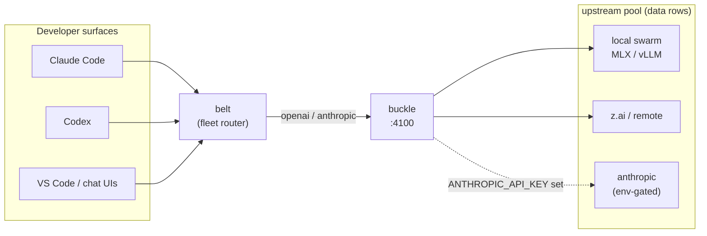

# buckle

> Part of the klh fleet — see [ECOSYSTEM.md](ECOSYSTEM.md) for the full
> cross-repo architecture map (speedy/suspenders/buckle/belt/klh-local).

LLM gateway: multi-provider serving + governance in one Bun/TypeScript
process. Two client wire dialects (OpenAI, Anthropic) in front of the
LiteLLM-internal engine (W219.1) and the 100+ provider catalog
(W150) — the serving layer of the
[klh agent stack](https://github.com/klh/suspenders) — belt routes,
buckle serves.



## What it does

- **Two client wires, many providers** — OpenAI `/v1/chat/completions`
  and Anthropic `/v1/messages` are the client-facing dialects; behind
  them the LiteLLM-internal engine routes to 100+ providers as data rows
  (`upstreams.yaml` + the W150 catalog), not two hardwired backends.
  `BUCKLE_CROSS_DIALECT=on` (default off) lets a ladder rung fail over
  between wire dialects through the tool/stream transforms
  (`src/bridge.ts`): anthropic client → openai upstream (JSON +
  streaming), openai client → anthropic upstream (JSON only).
- **Upstreams are data, not code** — `upstreams.yaml` group rows
  (`url`, `dialect`, `adapter`, `api_key_env`), the same move LiteLLM's
  own long tail made (`openai_like/providers.json`). The provider catalog
  (W150) carries 100+ providers as rows; unknown providers ride the
  `openai-compat` catch-all with `adapter_config`.
- **Cloud rows ship dormant** — committed rows are env-gated: a deployment
  with `api_key_env: ANTHROPIC_API_KEY` activates only when that variable
  exists at runtime. Keys never live in committed files.
- **Ladder routing** — ordered fallback walk per `routing-policy.yaml`,
  retry with retry-after honoring, cooldown ejection after repeated
  failures, hour-bucket usage ledger.
- **Governance seams** — budgets, per-key/team ceilings, entitlement
  checks and federation hooks hang off the router core (see the suspenders
  design docs).
- **Repo-policy gate (W7)** — hub-connected sessions check the repo in
  view against `repo-policy.yaml` data rows (`{id, repoClass, detect,
check, missingQuestion, policySource}`): silent when satisfied, one
  actionable missing-question per found gap. `POST /repo-policy/check`
  or `bun bin/repo-policy.ts <repo-root> [--resolve-facts]`. Internal
  policy text stays in LOCAL-ONLY coord facts (`fact:finding.ikea-*`),
  resolved only on the local owner-report path.

## Status

Shadow-port complete, cut-over managed by the control plane
(`docs/cut-over-runbook.md`): the gateway binds the serving port only
after the owner flips it; until then the previous gateway keeps serving.

## Run

```sh
bun install
bun run src/server.ts        # binds the configured port (loopback default)
bun test                     # adapter, ladder and citizenship suites
```

`upstreams.yaml` documents the row format inline. Override at runtime with
`BUCKLE_UPSTREAMS=/path/to/extra.yaml` (merged by group name; never
committed).

Egress law (startup-fatal, `src/adapters/egress.ts`): upstream `url`s are
https, or plain http to a loopback literal; other plain-http hosts must be
listed in `BUCKLE_HTTP_UPSTREAM_HOSTS`. Azure/Vertex `token_host` must be
https and on the family allowlist (extend with `BUCKLE_TOKEN_HOSTS`);
loopback token mocks need `BUCKLE_TOKEN_HOST_LOOPBACK=on`.

## Design sources

- `docs/design/belt-native-router-2026-10-01.md` (suspenders repo) —
  architecture and build order
- `docs/research/litellm-internals-2026-10-01.md` — line-precise LiteLLM
  references (usage sniff, retry-after semantics, cooldown)
- `docs/design/buckle/adapters-2026-10-01.md` — the five adapter families
  and the provider-as-data law

License: see [LICENSE](LICENSE). Litellm internals were studied as
documentation only; no code was copied.
