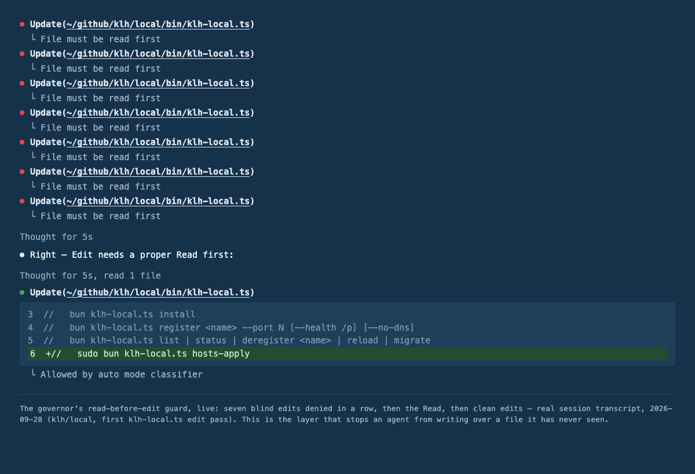

# speedy

> Part of the klh fleet monorepo — the system overview (packages, flow
> diagrams, laws, ops) lives at the fleet root: [README.md](../../README.md).


Make Claude Code **10–1400x faster** at file operations — and **structurally safe** at editing.

> **Platform: macOS.** The installer drives Homebrew, launchd, and zsh defaults, and the hooks assume macOS tooling. Linux is untested and Windows is not supported.

Based on [agent-skills](https://github.com/addyosmani/agent-skills), extended with three layers that work together:

1. **Speed** — modern CLI tools + `CLAUDE.md` rules that replace sequential Read+Edit with single parallel pipelines
2. **Safety** — governor gates that block fragile shell edits and run qlty fmt + lint on every save
3. **Autonomy** — evidence-based permission allowlist + `acceptEdits` so the agent works without prompting

Companion repo: **[klh/skills](https://github.com/klh/skills)** — personal `klh-*` skill variants (`npx skills add klh/skills`).

The klh chain — speedy is the speed + safety config layer on top of three focused repos:

| Repo                                                | Role                                                             |
| --------------------------------------------------- | ---------------------------------------------------------------- |
| [klh/suspenders](https://github.com/klh/suspenders) | Control plane — governor.db, gate hooks, work graph, fleet board |
| [klh/belt](https://github.com/klh/belt)             | Local LLM fleet — MLX specialists behind a deterministic router  |
| [klh/local](https://github.com/klh/local)           | klh-local — registers local services at `<name>.local` via Caddy |

```
  DEFINE          PLAN           BUILD          VERIFY         REVIEW          SHIP
 ┌──────┐      ┌──────┐      ┌──────┐      ┌──────┐      ┌──────┐      ┌──────┐
 │ Idea │ ───▶ │ Spec │ ───▶ │ Code │ ───▶ │ Test │ ───▶ │  QA  │ ───▶ │  Go  │
 │Refine│      │  PRD │      │ Impl │      │Debug │      │ Gate │      │ Live │
 └──────┘      └──────┘      └──────┘      └──────┘      └──────┘      └──────┘
  /spec          /plan          /build        /test         /review       /ship
```

---

## The two problems

**Speed.** Claude Code edits files one at a time. Each Read/Edit round-trip costs ~0.5–1s; a 50-file change burns ~50s before any thinking happens. Single CLI pipelines do the same work in milliseconds.

**Safety.** Agents left to themselves edit via `cat >> file <<'EOF'` heredocs and inline `python3 - <<EOF` rewriters — prompt-free but context-blind, untracked, never syntax-checked. Speed without guardrails produces fast broken code. This repo now ships both.

## Benchmarks

Tested on a real codebase (733 TypeScript files, ~2500 total files, Apple M-series, 10 cores):

| Operation                                          | Files | Claude Default                | CLI Pipeline                                          | Speedup                                |
| -------------------------------------------------- | ----- | ----------------------------- | ----------------------------------------------------- | -------------------------------------- |
| Multi-file find & replace                          | 47    | Read+Edit ~95s                | `rg -l -0 \| xargs -0 -P8 sd` sub-second              | **~100x**                              |
| Codebase-wide rename                               | 538   | ~538s sequential              | `ambr` 490ms                                          | **~1100x**                             |
| **Structural rename (strings/comments untouched)** | 2+    | `ambr` (rewrites strings too) | `ast-grep run -p 'old($A)' -r 'new($A)' --lang ts -U` | **correct where text tools are wrong** |
| Count pattern matches                              | 346   | Grep+Read+count ~5s           | `rg -c \| awk` 54ms                                   | **~90x**                               |
| Find files                                         | 733   | `find` 3573ms                 | `fd` 56ms                                             | **64x**                                |
| Regex replace                                      | 346   | `sed -E` 1530ms               | `sd -s` 921ms                                         | 1.7x                                   |
| Bulk rename (parallel)                             | 538   | `fd --threads=1` 3269ms       | `fd -x` 1109ms                                        | **3x**                                 |
| JSON parsing                                       | —     | `python3 -c` 56ms             | `jq` 31ms                                             | 1.8x                                   |
| File copy (NFS)                                    | —     | `cp` 6m18s                    | `xcp` 37s                                             | **10x**                                |

## The editing stack (fast AND safe)

| Layer                  | Mechanism                                                                                                                                                  |
| ---------------------- | ---------------------------------------------------------------------------------------------------------------------------------------------------------- |
| Surgical edit          | Claude Code **Edit** tool — unique context anchor, ambiguity fails loudly, auto-accepted (`acceptEdits`)                                                   |
| New/whole file         | **Write** tool                                                                                                                                             |
| Textual bulk replace   | `sd` (regex) · `ambr`/`ambs` (parallel, with `--statistics`)                                                                                               |
| Structural replace     | `ast-grep` — AST nodes only; strings and comments stay untouched                                                                                           |
| Structured config      | `jq` (JSON) · `yq` (YAML/TOML/XML)                                                                                                                         |
| Enforcement            | the suspenders pre-bash gate denies `cat > f`, `cat >> f`, `sed -i`, `perl -i`; nudges heredoc rewriters toward Edit/Write                                 |
| Post-edit verification | the suspenders post-files gate — qlty fmt + fast lint on every save, blocks with the diff inline                                                           |
| Lint / dev loop        | `qlty check` — one diff-aware command (`qlty init -y && qlty plugins enable biome` on first use; biome owns code formatting, prettier stays markdown-only) |

**Why the enforcement exists:** `cat` is auto-allowed by the harness, so shell heredoc writes were the model's prompt-dodging workaround — every one of them invisible to diffs and unchecked. Denying the pattern and making Edit/Write prompt-free removes both the failure mode _and_ the incentive.

## Hooks

speedy ships two hooks itself; `install.sh` wires the suspenders gate
suite that does the enforcement.

| Hook / gate                     | Event                     | Job                                                                                |
| ------------------------------- | ------------------------- | ---------------------------------------------------------------------------------- |
| `insight-recall.ts`             | UserPromptSubmit          | surfaces lessons from past sessions at each prompt                                 |
| `pa-prefix.ts`                  | UserPromptSubmit          | personal-assistant trigger detection                                               |
| suspenders `gate.ts pre-bash`   | PreToolUse (Bash)         | secrets (gitleaks) · shell file-write deny · skill-install gate · fast-tool nudges |
| suspenders `gate.ts governor`   | PreToolUse (files)        | edit-leases and project-scoped permissions                                         |
| suspenders `gate.ts pre-files`  | PreToolUse (files)        | config-guard: control-plane writes require YOUR approval                           |
| suspenders `gate.ts post-files` | PostToolUse               | qlty fmt + fast lint on every save — blocks with the diff inline                   |
| suspenders `gate.ts stop`       | Stop                      | claim-done evidence gate before the turn ends                                      |
| suspenders session-start/-end   | SessionStart / SessionEnd | coordination bootstrap + teardown                                                  |

Register via `settings.example.json`. The read-before-edit guard, live —
seven blind edits denied, then the Read, then clean edits (real session
transcript, 2026-09-28):



## Multi-agent coordination — the converged architecture

For N coding lanes on one machine (learned from a 9-lane session + a fleet-wide
architecture review): **isolate execution, serialize only integration.** The
control plane behind this table — governor.db, edit-leases, area claims, the
event bus, zombie monitor, usage windows, the fleet board — ships in
**[klh/suspenders](https://github.com/klh/suspenders)**; speedy is the
speed + safety config layer on top of it.

| Layer                  | Mechanism                                                                                                                                                                                                                                                                          |
| ---------------------- | ---------------------------------------------------------------------------------------------------------------------------------------------------------------------------------------------------------------------------------------------------------------------------------- |
| Execution isolation    | One git worktree per lane — agents never share a mutable filesystem                                                                                                                                                                                                                |
| Write arbitration      | Governor edit-leases (`locks` table): first-touch per file, content-hash versioning (external-write detector), single-statement reads/writes — WAL arbitrates concurrent gate processes, no lost-update window                                                                     |
| Area claims            | `claims` table driven by a terse claim CLI — coarse scopes (`src/auth`) with `intent`; cross-area touches are **drift-logged** (soft) or **denied** (only hot areas); claims validated against live session transcripts (fabricated ids refused)                                   |
| Event bus              | `coord emit / poll / wait / fact` — agents share state **by reference** (structured events, per-agent cursors, versioned facts), never by retelling prose; `wait` is an adaptive long-poll (250ms → 2s backoff, instant wake on events). SendMessage stays reserved for interrupts |
| Liveness               | Leases expire when quiet 15 min **and** the owner's transcript is dead — a lane in one long tool call never loses its lease mid-work; claim heartbeats are single-statement UPDATEs on the same DB                                                                                 |
| Keepwarm               | suspenders `llm-keepwarm.ts` + launchd every 4 min: a 1-token **nonce** ping per resident specialist (a cache HIT would skip the forward pass and leave weights paged out) — kills the 27–50s idle-paging first-touch stall                                                        |
| Capability dispatch    | `requires` on work items ⊆ `capabilities` on sessions (csv; lanes inherit the parent's) — `work take` refuses mismatches, so a no-shell agent type can never be handed shell work twice                                                                                            |
| Zombie detection       | Three-state monitor (ZOMBIE = hb + transcript both stale; SUSPECT = one; lookup failure = UNKNOWN, never death) on a 15-min launchd — alerts the canonical coordinator (`fact coordinator.sid`), never auto-reclaims; WAIT_RATE/PAUSED lanes are expected-silent                   |
| Usage windows          | `quota-window.ts` remembers observed 429 resets (5h cliffs) — dispatch defers around the cliff, and the degradation path is the local LLM stack keeping lanes crawling through blackouts instead of dying                                                                          |
| Fleet board            | suspenders `fleet-board.ts`: live dashboard on 127.0.0.1:7799 — every session, per-project task boards, decisions with LLM recommendations, and a NEEDS-YOUR-ANSWER panel surfacing `NEED_DECISION` events with inline owner answers                                               |
| Early conflict warning | `git merge-tree --write-tree <head> <lane>` — pure three-way merge simulation, no working-tree mutation, run between overlapping lanes' checkpoints                                                                                                                                |
| Integration spine      | One integration worktree; lane commits merge onto the integration HEAD, **qlty runs on the merged state**, green advances HEAD                                                                                                                                                     |
| Repair                 | Conflicts go to a small repair agent in a disposable worktree — never wake both origin lanes                                                                                                                                                                                       |
| Lane output            | Checkpoint commits every 10–20 min; lanes report `{base SHA, commit SHA, changed paths, test status}` — the coordinator operates on immutable commits, never working dirs                                                                                                          |

The one rule that matters most: **a lane being green is not sufficient — the
lane merged onto the current integration HEAD must be green.** Coordinator
output is **delta-only**: emit state changes (MERGED / SPAWNED / ALERT / EXIT),
suppress unchanged state and passing-test detail — the bus holds the details,
prose is for failures and decisions. Deliberately
NOT built (over-engineering at local scale): semantic MVCC, symbol-version
ownership, AST merge, distributed lock managers, a message broker (NATS is the
upgrade path if lanes ever go multi-machine). If finer control is ever needed,
start with `ts-morph`-based symbol edits (`ts_edit`) before anything heavier.

Unattended install of the coordination plane (claims/leases/event-bus CLIs +
keepwarm agent) and the local LLM fleet: `install.sh` handles both — the
control plane ships in
**[klh/suspenders](https://github.com/klh/suspenders)** (shallow clone + its
`./install.sh --wire`, namespaced under `~/.claude/hooks/suspenders/`; macOS
agents — fleet monitor, LLM keepwarm, board keep-alive, rolling db backups —
opt-in via its `./install.sh --with-launchd`) and the fleet itself in
**[klh/belt](https://github.com/klh/belt)** (deployed to `~/.claude/local-llm/`,
tier picked by `install.sh --llm=minimal|full`; models + `com.belt.*` agents
opt-in inside belt). With [klh-local](https://github.com/klh/local) on the
machine, `install.sh` also registers `suspenders.local` (:7799) and
`belt.local` (:7791) as Caddy `.local` services. Only the klh-specific
claude-insights agent remains in this repo's
[hooks/launchd/](hooks/launchd/). The ready-to-copy binding protocol for a multi-agent
repo lives in [docs/coordination-protocol.md](docs/coordination-protocol.md).

## Autonomy settings

`settings.example.json` is a ready template: GLM/z.ai (or any Anthropic-compatible) env vars, `acceptEdits`, an evidence-based allowlist (fast CLI tools + `npm test`/`dotnet test`/`git fetch`/`npx tsc --noEmit`), and deny guardrails (`sudo rm`, force-push, `rm -rf ~/*`). Copy to `~/.claude/settings.json`, fill the token, adjust to your stack.

## Skills — 36 active (klh-\* variants + audited registry adds)

A 2026-09 audit (`skillUsage` telemetry across months of sessions) found ~half the original skill pack was never invoked — pure context cost in every session. The active set is curated; the rest are parked in [`skills-available/`](skills-available/README.md) with a restore command (`git mv skills-available/<name> skills/`). Parked skills cost zero context.

Highlights: `ast-grep` (structural search rules) · `docker` · `az` · `sqlite`/`sql-best-practice` · `csharp-best-practice` · `cli-speed-tools` · `code-simplifier` · `find-bugs` · `lit-dev` · `core-components` · `zod4` · `test-driven-development` · `systematic-debugging` · `openapi-directory-first` · `browser-testing-with-devtools` · `settings-audit` · `project-memory` · **`agentaccess`** (Danish services → AgentAccess.dk first; OSS/local-first MCP builder stack) — full table in CLAUDE.md's _Skills Quick Reference_.

## Slash Commands

| What you're doing    | Command   | Key principle       |
| -------------------- | --------- | ------------------- |
| Define what to build | `/spec`   | Spec before code    |
| Plan how to build it | `/plan`   | Small, atomic tasks |
| Build incrementally  | `/build`  | One slice at a time |
| Prove it works       | `/test`   | Tests are proof     |
| Review before merge  | `/review` | Improve code health |
| Ship to production   | `/ship`   | Faster is safer     |

## Agent Personas

| Agent                                                        | Role                     | Perspective                                                                                                    |
| ------------------------------------------------------------ | ------------------------ | -------------------------------------------------------------------------------------------------------------- |
| [code-reviewer](agents/code-reviewer.md)                     | Senior Staff Engineer    | Five-axis code review                                                                                          |
| [test-engineer](agents/test-engineer.md)                     | QA Specialist            | Test strategy, coverage analysis                                                                               |
| [security-auditor](agents/security-auditor.md)               | Security Engineer        | Vulnerability detection, OWASP                                                                                 |
| [minimalist-designer](agents/minimalist-designer.md)         | Modernist Minimalist     | A11y + DOM mastery, strict palettes, retro-minimal when it fits                                                |
| [mj-graphic-designer](agents/mj-graphic-designer.md)         | Tufte-School Graphics    | Data-chaste layouts, ink-to-information, MJ imagery when it serves the design                                  |
| [mj-typographer](agents/mj-typographer.md)                   | Typographer              | Face pairing, type scales, lettering and wordmark studies via Midjourney                                       |
| [mj-book-designer](agents/mj-book-designer.md)               | Book Designer            | Long-form layout, whitespace as structure, MJ cover concepts                                                   |
| [mj-product-photographer](agents/mj-product-photographer.md) | Product Photographer     | Studio-lit product renders with one deliberate color decision, via Midjourney                                  |
| [mj-art-director](agents/mj-art-director.md)                 | Art Director             | Campaign concepts, color stories, shot lists — directs the shoot, doesn't take it                              |
| [mj-model-director](agents/mj-model-director.md)             | Editorial Model Director | Casting, posing, styling — dignified people-in-frame imagery via Midjourney                                    |
| [mj-illustrator](agents/mj-illustrator.md)                   | Illustrator              | Consistent illustration languages: marks, spot illustrations, series discipline                                |
| [growth-marketer](agents/growth-marketer.md)                 | Low-Budget Growth        | Offers, SEO/email flywheels, merch and product launches                                                        |
| [outreach-strategist](agents/outreach-strategist.md)         | Research-First Outreach  | Context sheets, tailored cold email, sequence design                                                           |
| [devops-systems-engineer](agents/devops-systems-engineer.md) | PaaS × Bare Metal        | Fast flight + low cost, hybrid hosting, runbooks                                                               |
| [llm-performance-analyst](agents/llm-performance-analyst.md) | Agent Ops                | Transcript metrics: token waste, tool efficiency, error-pattern taxonomy with preventive prescriptions         |
| [tool-stack-auditor](agents/tool-stack-auditor.md)           | Stack Economics          | Audits the online services personas use (marketing, shops, JIT/print, hosting) for better/cheaper alternatives |

## Code style this repo encodes

Modular and DRY _within sanity_. Event mediator/composition over inheritance. Close to the metal over abstraction — Lit/web components over React-class frameworks, platform APIs over wrappers. Boring, inspectable code. (Full section in CLAUDE.md.)

## Multi-agent workflows

Say **`ultracode <task>`** or "use a workflow" in Claude Code to fan out an orchestrated multi-agent run — parallel review dimensions with adversarial verify passes, bulk migrations, research fan-outs. Default size medium (~≤15 agents). Works on GLM/z.ai setups; subagents inherit session model config.

## MCP recommendations — OSS/local-first

Hard rule: **open-source, self-hosted, no paid tiers in the stack.** Model access is the only paid component. For Danish services, check [AgentAccess](https://agentaccess.dk) first (see the `agentaccess` skill for the full access hierarchy: official MCP → OpenAPI MCP Proxy → Har2MCP → Playwright MCP → Crawl4AI).

| Need                            | Server/Tool                                       | License    |
| ------------------------------- | ------------------------------------------------- | ---------- |
| Browser testing / DOM / network | `chrome-devtools-mcp`                             | OSS        |
| Current library docs            | `context7` (`https://mcp.context7.com/mcp`)       | free       |
| Browser access for the model    | `Playwright MCP` (`@modelcontextprotocol/server`) | MIT        |
| Build your own MCP (TS)         | `@prefecthq/fastmcp-ts` + Zod                     | Apache-2.0 |
| Test/debug MCPs                 | `npx @modelcontextprotocol/inspector`             | MIT        |
| Web → clean Markdown            | Crawl4AI (self-hosted Docker)                     | OSS        |
| Undocumented APIs → MCP         | Har2MCP (HAR capture → tools)                     | OSS        |

```bash
npm i -g chrome-devtools-mcp
claude mcp add -s user chrome-devtools -- chrome-devtools-mcp
claude mcp add -s user -t http context7 https://mcp.context7.com/mcp
```

## Skill install gate (how to complete it)

The `skill-install` gate blocks installs into skills dirs until a review approval is minted — by **you**, never the agent self-approving. After accepting a `skill-security-review` PASS:

```bash
approve-skill <source-ref>   # mints single-use, 24h, source-bound HMAC approval (~/​.local/bin)
# then retry the install command — the gate consumes the approval
```

Requires `~/.claude/.skill-review-secret` (32-byte hex, 0600). Reference implementation: `hooks/approve-skill.ts` + `hooks/lib/approvals.ts`.

## Local LLM fleet (optional layer)

The local-inference layer is **[klh/belt](https://github.com/klh/belt)** —
a specialist swarm of MLX models behind a deterministic router, with the
benchmark rig, the measured results, and the add-a-model guide (including the
rejection log). Routine agent traffic never leaves the machine; suspenders'
advice worker and keepwarm ride belt's endpoints. `install.sh` deploys belt
when you pass an LLM tier — `--llm=minimal` (small models only, ~3GB resident,
for machines without 64GB+ unified memory) or `--llm=full`; fresh installs
default to `--llm=off` (cloud-only) and upgrades keep an already-deployed
fleet. Models and launchd agents are opt-in inside belt:

```bash
git clone https://github.com/klh/belt && cd belt
./install.sh --with-models --with-launchd
```

## Install

### Option 1: Clone into ~/.claude (recommended — like dotfiles, full restore)

```bash
mv ~/.claude ~/.claude.bak
git clone https://github.com/klh/speedy.git ~/.claude
~/.claude/install.sh                      # add --llm=minimal|full for the local LLM fleet
cp ~/.claude/settings.example.json ~/.claude/settings.json  # then edit token/allowlist
```

This restores the complete setup: 36 skills, 16 personas, hooks (insight-recall + pa-prefix + the suspenders gates), slash commands, statusline, and CLAUDE.md. The seven `mj-*` personas additionally need a `midjourney` MCP server exposing `mj_imagine`, `mj_describe`, `mj_blend`, `mj_button`, `mj_job`.

### Option 2: CLI tools only (no skills)

```bash
curl -fsSL https://raw.githubusercontent.com/klh/speedy/main/install.sh | bash
# pick an LLM tier:  curl -fsSL https://raw.githubusercontent.com/klh/speedy/main/install.sh | bash -s -- --llm=full
```

### Option 3: Skills via npx

```bash
npx skills add klh/speedy -g -y   # or the companion: npx skills add klh/skills -g -y
```

`install.sh` installs 35+ tools (brew/cargo + the qlty release binary), sets `delta` as git pager, and initializes `zoxide`. It does **not** touch your `settings.json` — copy `settings.example.json` yourself.

### Automated daily review (optional, session-independent)

Headless `claude -p` performance + tool-stack audits at 06:43 daily, findings land in `~/.claude/insights/` and surface at the next session start:

```bash
cp ~/.claude/hooks/daily-insights.sh ~/.claude/hooks/            # already there via clone
cp ~/.claude/hooks/launchd/com.klh.claude-insights.plist ~/Library/LaunchAgents/
sed "s|__HOME__|$HOME|g" ~/.claude/hooks/launchd/com.klh.claude-insights.plist > ~/Library/LaunchAgents/com.klh.claude-insights.plist
launchctl bootstrap gui/$(id -u) ~/Library/LaunchAgents/com.klh.claude-insights.plist
```

Statusline: reference implementation in `statusline.ts` — register with
`"statusLine": {"type": "command", "command": "bun $HOME/.claude/statusline.ts"}` in settings.json.

## The full dev loop

```
implement  →  tests  →  qlty fmt + qlty check --fix (staged)  →  difft review  →  merge
```

Quality runs at three moments: the governor post-files gate applies qlty fmt + fast lint on every write (blocking with the diff inline), the pre-merge ladder runs `qlty fmt` + `qlty check --fix` on staged files, and the stop gate is evidence-only — it verifies the work happened, it does not lint. The agent participates in the whole loop, not just generation — verified by tooling before anything is claimed done.

## License

MIT

---

a [Threads](http://www.threads.dk) thing
