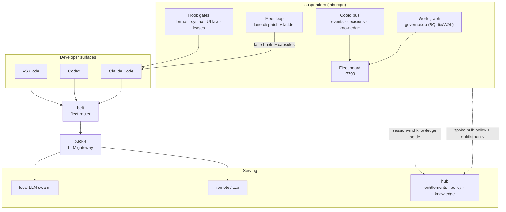

# suspenders

> Part of the klh fleet monorepo — see [ECOSYSTEM.md](ECOSYSTEM.md)
> for the whole-stack map — all of packages/*, one file away.

The control plane for agent fleets: a SQLite work graph, a coordination
bus, a live fleet board, and hook gates that keep autonomous lanes honest.
The spine of the [klh agent stack](https://github.com/klh/fleet) —
[buckle](https://github.com/klh/fleet/tree/main/packages/buckle) is its gateway, belt its router,
klh/local the LAN fabric, speedy the installer.



## What's inside

- **Work graph** — hierarchical, shatterable items (`work add / split /
done`), claims, dependency edges, lifecycle verbs (unclaim, cancel,
  reassign, second-opinion), capsule handoff so any lane can resume on
  another brain.
- **Coord bus** — questions-over-ownership (`consult`, `who-knows`),
  decision forks surfaced to the human (`NEED_DECISION`), facts and
  lessons as the fleet's durable memory, knowledge harvest from lane
  transcripts.
- **Fleet board** — live SPA over the graph: decisions with LLM
  recommendations (user-configurable model), tasks with executor
  preferences and dependency state, lanes, usage attribution per
  actor/model, governor backpressure view.
- **Hook gates** — every write passes format (qlty/biome/prettier),
  syntax, size, UI-law (never `innerHTML`), and lease checks; the
  1500-line hard limit is enforced on-save.
- **Fleet loop** — dispatches READY items as worktree lanes with
  capsule briefs, runs the merge ladder, watches liveness.
- **Federation** — hub + spokes: entitlements echo, spoke-pull policy,
  change-request channel, hub-only signing keys, ML-KEM (PQC) wire.

## Quick start

```sh
bun install
bun test
bun hooks/bin/fleet-board.ts            # the board
bun hooks/bin/work.ts list              # the graph
bun hooks/bin/coord.ts fleet            # who is working
```

## Command surfaces

Every operational need is a supported verb — never a shell loop against
the plane. The two CLIs are the product; know them cold.

### Work graph — `bun hooks/bin/work.ts <verb>`

```sh
work add "title" --priority 2 --desc "why"          # register work
work list                                           # the whole graph
work ready                                          # dispatchable now
work show <id>                                      # one item + claims
work take <id> --as <sid>                           # claim it
work start <id> --as <sid>                          # mark RUNNING
work done <id> --as <sid> --sha <commit>            # close with evidence
work fail <id> --as <sid> --note "why"              # close as failed
work release <id> --as <sid>                        # give it back
work reclaim <id> --as <sid>                        # take a stalled claim
work reclaim all                                    # bulk-free dead claims
work orphaned                                       # claims with dead owners
work split <id>                     # shatter for parallel lanes
work block <id> --on <other-id>                     # gate it
work supersede <id>                                 # replace it
work migrate-ledger                                 # import a - [ ] list
```

### Coord bus — `bun hooks/bin/coord.ts <verb>`

```sh
coord fleet                      # who is working (sessions + claims)
coord state --as <sid>           # your session view
coord inbox --as <sid>           # unread messages/consults
coord message --to <sid> --note "…" --as <sid>   # interrupts only
coord broadcast --note "…" --as <sid>            # fleet-wide
coord consult --to <ikea-opus> --note "question" --as <sid>
coord consult-reply --reply-id <id> --note "…" --as <sid>
coord fact get lesson.<topic>    # painful knowledge, fleet-shared
coord fact set lesson.<topic> --note "…"         # write back a lesson
coord emit NEED_DECISION --to <coordinator> --note "q + options" --as <sid>
coord subscribe --as <sid>       # live WebSocket push (W303)
coord gc                         # settle dead sessions
coord doctor-session <sid>       # rebind a resumed session
```

### Dispatch + fleet loop

```sh
bun scripts/dispatch-next.ts                       # churn lanes onto READY
bun scripts/dispatch-next.ts --item W219 --dry-run # one item, no writes
bun hooks/bin/fleet-loop.ts watch \
  --repo . --glob 'suspenders/*' \
  --ladder 'git merge --no-ff {branch}' \
  --dispatch-cmd 'bun scripts/dispatch-next.ts' \
  --target 8 --every 120         # merge ladder + dispatcher (launchd)
```

### Quota sweep — `bun hooks/bin/quota-sweep.ts`

```sh
bun hooks/bin/quota-sweep.ts           # report: quota hits per claimant sid
bun hooks/bin/quota-sweep.ts --act     # pickup: reclaim dead sid's claims →
                                       # READY + coord emit + broadcast
                                       # (launchd, every 15 min)
```

### Fleet board

Served at `http://suspenders.local/` (LAN); API map at `/llms.txt`,
routes in `hooks/board/routes-*.ts`.

## Repo law

- One ledger: todos live on the work graph, never scattered in repos.
- `CLAUDE.md` files are law for lanes: streams over buffers, Lit for UI
  (never `innerHTML`), 1500-line hard limit, qlty quality gates.
- Config over code: machine facts ride `~/.claude/local-llm/*.json`
  (never committed); repos carry placeholders only.

License: see [LICENSE](LICENSE).
