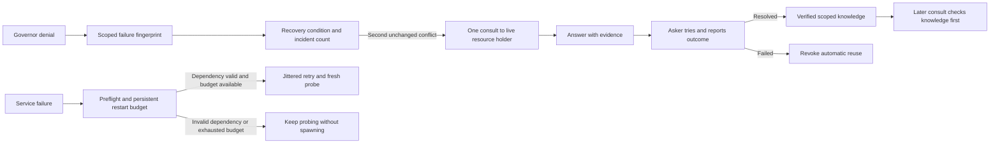

# Fleet: enterprise deployment gaps and practical optimizations

Research date: **5 October 2026**. Repository snapshot: `87e6218`.

This document combines the [monorepo review](docs/monorepo-review-2026-10-05.md),
fresh source inspection, and online research from primary documentation. It is
the requested research and recommendation list; implementation and ownership
remain in the work graph. No recommendations below have been implemented here.

## What the review found

The architecture is coherent, but consolidation moved source ahead of the
installation, deployment and automation contracts that consume it.

| Priority | Finding                                                | Evidence                                                                                           | Required result                                                                        |
| :------- | :----------------------------------------------------- | :------------------------------------------------------------------------------------------------- | :------------------------------------------------------------------------------------- |
| P1       | Clean harness installation omits BLAM                  | `packages/suspenders/install.sh`; board `prompt-transform.ts` and `orch.ts` import BLAM relatively | Installed board modules load in an isolated home without any old checkout              |
| P1       | No root GitHub Actions workflow                        | Workflows exist under package `.github/` directories                                               | Root CI runs package tests, cross-package checks and installed-artifact checks         |
| P1       | Hub deployment assumes legacy repositories and layouts | `packages/suspenders/deploy/hub-compose.yaml`, `hubctl.ts`                                         | A pinned fleet checkout/artifact boots with correct `packages/` paths and dependencies |
| P2       | Workspace and release contracts are incomplete         | No root lockfile; local/speedy lack manifests; root and package versions differ                    | Reproducible dependency installation and explicit stack/package version semantics      |
| P2       | Umbrella installer clones legacy sources               | `packages/speedy/bin/install-fleet.ts`                                                             | All phases consume the same fleet revision                                             |
| P2       | Board implementation still conflicts with its Lit law  | `packages/suspenders/hooks/board-html/core.ts`, `tasks.ts` use `innerHTML`                         | Component migration validated for draft, selection and focus retention                 |

The installed BLAM import failure was reproduced during the preceding review;
120 focused source tests passed then. This research rechecked the relevant
installer/import code, workflow locations, deployment origins and legacy
installer acquisition paths; it did not rerun that complete test sequence.

The local-LLM extraction has landed. It is now a real package, not a placeholder.
Subsequent belt and buckle commits also delegate condensing to BLAM, making the
cross-package distribution contract more important.

GitHub explicitly requires workflow files in the repository's `.github/workflows`
directory. Moving nested YAML is only part of the fix: adjust working directories,
dependency setup and paths too. [GitHub workflow syntax](https://docs.github.com/en/actions/reference/workflows-and-actions/workflow-syntax).

## What already exists

Do not rebuild these controls under new names:

- Gateway scopes, hashed virtual keys, expiration/revocation, team/key budget
  machinery and JWT hooks: `packages/buckle/src/gov/`.
- Retry-after handling, jitter and cooldowns: `packages/buckle/src/router.ts`
  and `cooldown.ts`. Client cancellation is threaded into upstream execution.
- Prometheus-style `/metrics` and structured service status: buckle and
  suspenders `servicemon.ts` modules.
- Independent network health sidecars: `packages/suspenders/deploy/healthcheck/`.
- Consistent governor snapshots, integrity checks and rotation:
  `packages/suspenders/hooks/bin/db-backup.ts`.
- SQLite WAL, busy timeout, a serialized RPC store and tagged transactions:
  suspenders `govdb.ts` and `store-server.ts`.
- Decision-answer idempotency tokens and coordination WebSocket subscriptions.

The enterprise question is whether these controls remain correct across tenants,
replicas, restarts, failures and upgrades. Source presence is not deployment proof.

## Additional concrete findings

### A. Verify the bundled SQLite WAL-reset patch before deployment

The installed Bun runtime returned **SQLite 3.51.0** from an in-memory query:

```sh
bun -e 'import {Database} from "bun:sqlite"; const db = new Database(":memory:"); console.log(db.query("select sqlite_version() as version").get()); db.close();'
```

SQLite documents a rare WAL-reset race affecting versions through 3.51.2, fixed
in 3.51.3 and later, with specified older backports. Fleet uses WAL with multiple
connections/processes, so patch verification is relevant. The version string
alone does **not** prove Bun lacks a vendor backport; no corruption was reproduced.
[SQLite WAL-reset advisory](https://sqlite.org/wal.html#walresetbug).

**Action:** establish a supported Bun/container runtime whose embedded SQLite fix
is verified by version or upstream backport evidence. Check the actual SQLite
library inside every release artifact, not only the host `sqlite3` executable.
Make runtime/SQLite version reporting part of deployment diagnostics and CI.

### B. Knowledge backup is weaker than governor backup

`db-backup.ts` uses `VACUUM INTO` for governor.db, but knowledge.db follows a
checkpoint with separate file copies of the DB and possible WAL. Writers can
resume between those copies; checkpointing is not a lock spanning the snapshot.
The code logs checkpoint `busy` rather than requiring successful completion.
Knowledge integrity failures also only log an error, after which the run can
still write `last-backup.txt`.

**Action:** use a consistent SQLite snapshot for knowledge too; publish successful
backup metadata only after all required snapshots pass checks. SQLite describes
`VACUUM INTO` as a consistent snapshot; verify completion and restoreability.
[SQLite VACUUM INTO](https://sqlite.org/lang_vacuum.html#vacuuminto),
[SQLite backup API](https://sqlite.org/backup.html).

Also sort `ksnaps` newest-first before choosing generation-slot entries. Unlike
the governor list, knowledge snapshots use `.find()` without timestamp sorting,
so retention does not reliably choose the newest snapshot in each slot.

**Acceptance:** concurrent-write backup test; restored database passes integrity
and application-invariant checks; failed knowledge snapshot fails the run;
rotation retains the newest timestamp per slot. These are source findings, not
reproduced production data loss.

### C. The gateway ledger has retry bounds, not a hard queue-capacity bound

`packages/buckle/src/ledger.ts` stores pending usage/audit entries in arrays.
`flushRows` triggers a flush; it does not cap admission. Failed writes requeue
entries; entries are eventually dropped after a configured retry count.

**Action:** set explicit maximum pending entries/bytes and age, with separate
durability policy for billing/security audit versus diagnostic telemetry.
Expose queue depth, oldest age, flush latency and dropped records. Critical audit
may need a durable spool or admission refusal; do not silently reinterpret the
current drop counter as durable audit evidence.

**Acceptance:** hold SQLite writes unavailable while applying sustained traffic;
memory remains bounded, overload responses are defined, and required audit events
are recoverable or requests are refused according to policy.

## Enterprise deployment gaps to close

The following are engineering recommendations. "Not established" means this
inspection did not find an end-to-end implementation or proof; it does not mean
every related feature is absent. The private fleet-remote checkout was not inspected.

### 1. Reproducible release, upgrade and rollback

**Current evidence:** loose base image tags (`oven/bun:1`, `alpine/git`), separate
repository pulls and no root lockfile. Stack pinning is already a stated law.

**Recommendation:** produce one release manifest containing fleet commit,
dependency lock digest, runtime/container digests, schema versions and artifact
checksums. Preserve the git-pulled-volume design if desired, but pull one verified
revision and prepare its dependencies reproducibly. Test upgrades from supported
prior schemas, migration failure, and rollback compatibility; code rollback alone
does not reverse database migrations.

Attestations can establish build provenance and be verified by CLI. GitHub plan
eligibility differs for public versus private repositories, so check it for
fleet-remote before adopting that service. [GitHub artifact attestations](https://docs.github.com/en/actions/how-tos/secure-your-work/use-artifact-attestations/use-artifact-attestations).

**Acceptance:** a clean machine reproduces the release; a failed upgrade retains
recoverable state; the documented rollback path is exercised. Add SBOM and
license-notice generation to the artifact pipeline after root CI works.

### 2. Explicit state ownership before horizontal scaling

**Current evidence:** SQLite files, process-local budgets/cooldowns, and a store
server accepting SQL RPC with one serialized connection. These are not a
demonstrated multi-writer cluster contract.

**Recommendation:** begin with one authoritative state owner per hub and local
storage, accessed over the API. Define ownership epochs/fencing for failover,
leader recovery, and how stale dispatchers are prevented from committing work.
Treat raw SQL RPC as a privileged internal interface, not a tenant-facing API.
Use a network database only if measured shared-write or HA requirements justify it.

SQLite WAL supports concurrent readers but a single writer, and requires callers
sharing the DB to be on the same host; do not scale by sharing its WAL files over
NFS/SMB. [SQLite WAL concurrency and deployment constraints](https://sqlite.org/wal.html).

**Acceptance:** kill the authority during claim/merge, resume the old process,
and prove there is no double claim, double merge or stale-state acceptance.

### 3. Tenant isolation and complete authorization coverage

**Current evidence:** key scopes, team fields, JWT hooks and private/hub domain
rules exist. A cross-tenant test matrix spanning graph, facts, subscriptions,
artifacts, caches, usage and administrative APIs was not established.

**Recommendation:** decide whether enterprise customers receive dedicated hubs
or share a hub. Bind organization/project context to verified identity; propagate
it into jobs and data access. Define operator, auditor and lane capabilities.
Test revoked membership and cross-tenant object IDs on every relevant surface.
Identity-provider group mapping and automated offboarding belong in the private
tier if that is its contract; SCIM is conditional on customer requirements.
[OWASP tenant isolation](https://cheatsheetseries.owasp.org/cheatsheets/Multi_Tenant_Security_Cheat_Sheet.html),
[OWASP authorization](https://cheatsheetseries.owasp.org/cheatsheets/Authorization_Cheat_Sheet.html).

**Acceptance:** tenant A cannot read, subscribe to, mutate, restore or export
tenant B's records, and membership revocation takes effect within a stated bound.

### 4. Replica-safe budgets and admission control

**Current evidence:** governance budget windows live in process memory with
periodic database flushing; key/team limits exist. Multiple gateways sharing a
team allowance would need a defined aggregate reservation protocol.

**Recommendation:** keep one budget authority initially or implement atomic
reservations shared across replicas. Reserve input and bounded output allowance,
then reconcile actual usage. Add limits for simultaneous generations, per-team
lanes, queue depth and GPU memory, with fair scheduling under contention.
Cross-tenant resource controls are part of isolation. [OWASP tenant resource controls](https://cheatsheetseries.owasp.org/cheatsheets/Multi_Tenant_Security_Cheat_Sheet.html#5-api-asynchronous-work-resource-controls).

**Acceptance:** concurrent requests through two processes cannot multiply a
team's quota; a noisy tenant cannot exhaust all inference slots.

### 5. End-to-end deadlines and replay-safe side effects

**Current evidence:** retry/backoff and cancellation exist, and decision answers
have idempotency tokens. A global attempt/deadline budget across router, gateway,
provider and orchestration was not established.

**Recommendation:** set a total request deadline and attempt budget across the
whole chain. Deduplicate retried task creation, dispatch, credential minting and
merge requests with durable operation IDs and payload-hash conflict detection.
Do not automatically replay generation after partial streamed output.
[AWS retry limits](https://docs.aws.amazon.com/wellarchitected/latest/reliability-pillar/rel_mitigate_interaction_failure_limit_retries.html),
[AWS idempotent APIs](https://aws.amazon.com/builders-library/making-retries-safe-with-idempotent-APIs/).

**Acceptance:** inject a lost response after a successful write; retries return
the original result rather than creating another lane/key/item. Provider failure
does not cause multiplicative retries or exceed the total deadline.

### 6. Service objectives, actionable alerts and correlated diagnostics

**Current evidence:** `/metrics`, route audits and health probes exist. A shipped
scrape/alert configuration, service-objective definitions and cross-service trace
context were not found in the inspected paths.

**Recommendation:** build on existing counters. Define objectives for control
API availability, dispatch delay, successful model service and recovery time.
Separate gateway overhead from inference latency, including time to first token.
Propagate trace context plus request/work/lane IDs through the chain; keep unique
IDs out of metric labels to bound cardinality. Export via a small collector.
[Google SRE monitoring](https://sre.google/workbook/monitoring/),
[Google SRE SLO alerts](https://sre.google/workbook/alerting-on-slos/),
[OpenTelemetry context propagation](https://opentelemetry.io/docs/concepts/context-propagation/).

**Acceptance:** a dropped audit batch, stuck dispatcher or sustained provider
failure produces a tested alert; an operator can follow one failed request across
services without searching unrelated logs. Start with actionable alerts, not a
dashboard for every available metric.

### 7. Restore drills and disaster-recovery coverage

**Current evidence:** governor/knowledge backup code and local rotation exist;
restore drills and a complete hub credential/policy/database backup inventory
were not established. Local snapshots do not cover machine loss.

**Recommendation:** define acceptable data-loss window (RPO) and restoration time
(RTO), inventory governor/knowledge/gateway/identity/config state, and keep
encrypted backups in a separate failure domain. Coordinate snapshot generation
across databases or reconcile their state on restore; separate snapshots do not
automatically represent one transactionally consistent system state.
[SQLite backup guidance](https://sqlite.org/backup.html).

**Acceptance:** restore into a clean hub, verify claims/dependencies and revoked
credentials, prevent duplicate dispatch, and measure recovery against the chosen
targets. Store encryption recovery material separately from the failed machine.

### 8. Deployment resource isolation and graceful draining

**Current evidence:** code volumes are mounted read-only and services restart,
but the hub template has no explicit CPU/memory/PID limits, capability drops,
non-root user selection or shutdown grace configuration.

**Recommendation:** add tested resource profiles, non-root execution where
compatible, capability restrictions, log rotation and a read-only root filesystem
with explicit writable state/tmp locations. Separate readiness from liveness.
Drain ingress, stop new dispatch, finish or checkpoint work, flush required
queues, then stop within the configured grace period.
[Docker Compose service controls](https://docs.docker.com/reference/compose-file/services/).

**Acceptance:** a service exceeding its memory budget cannot take down the hub;
a routine deployment does not sever every active stream or lose required writes.
Keep independent health sidecars; verify dependency/start ordering as well.

### 9. Audit retention, redaction and credential lifecycle

**Current evidence:** usage/admin audit machinery and revocable keys exist; the
route ledger deliberately permits eventual record dropping after flush failures.
Operational metrics are not automatically a durable enterprise audit trail.

**Recommendation:** classify critical admin/security events separately from
debug telemetry. Define retention/export/deletion rules, redact credentials and
prompt content by default, restrict audit access and protect exported evidence
against modification. Verify rotation/expiry for provider, bootstrap and lane
credentials, including emergency revocation and recovery.
[OWASP security logging](https://cheatsheetseries.owasp.org/cheatsheets/Logging_Cheat_Sheet.html).

**Acceptance:** key mint/revoke, policy changes and privilege changes remain
attributable after restart; secret canaries never appear in exported logs.

### 10. Capacity, failure and compatibility testing

**Current evidence:** many unit/integration suites, deterministic BLAM scenarios
and measured model benchmarks exist. A supported deployment capacity envelope
and full-stack failure qualification were not established by this review.

**Recommendation:** define target counts for active lanes, concurrent streams,
hubs, tenants and retained events. Exercise rising concurrency until saturation,
then provider failure, disk-full, locked DB, slow subscribers, restart and network
partition. Record p50/p95/p99, queue age, memory, WAL size and recovery correctness.
Verify each supported agent API dialect and runtime version with contract tests.
[Google SRE monitoring guidance](https://sre.google/workbook/monitoring/).

**Acceptance:** publish a measured supported envelope and degradation behavior;
passing unit tests is not the capacity claim. Use BLAM where its existing scenarios
match rather than inventing a second failure benchmark.

## Low-hanging optimizations

Effort labels are relative: **small** is localized, **medium** crosses services
or needs failure testing. No speedup percentage is claimed before measurement.

| Order | Change                                                                    | Effort                                        | Why it helps                                                                  | Acceptance / measurement                                                                          |
| :---- | :------------------------------------------------------------------------ | :-------------------------------------------- | :---------------------------------------------------------------------------- | :------------------------------------------------------------------------------------------------ |
| 1     | Verify/fix embedded SQLite patch level and pin supported runtime          | Small verification; upgrade validation varies | Removes avoidable WAL integrity exposure                                      | Artifact reports fixed SQLite or documented backport                                              |
| 2     | Package BLAM and add installed-module import smoke tests                  | Small-medium                                  | Catches source-versus-install failures immediately                            | Isolated install loads board and changed router/gateway modules                                   |
| 3     | Root CI with dependency-aware package paths and lock-keyed caching        | Small-medium                                  | Restores automation and avoids testing unrelated packages on every edit       | Shared BLAM changes trigger all consumers; cached and cold CI timings recorded                    |
| 4     | Consistent knowledge snapshot, fail the run on failure, sort rotation     | Small-medium                                  | Improves backup reliability without replacing storage                         | Concurrent-write restore and generation-selection tests                                           |
| 5     | Scrape current `/metrics` and alert on drops, failures, queue age         | Small-medium                                  | Uses existing instrumentation rather than adding another counter system       | Synthetic failures reach the operator with an actionable message                                  |
| 6     | Add ledger pending-entry/byte caps and bounded RPC admission              | Medium                                        | Prevents overload from becoming uncontrolled memory growth                    | Locked-DB/slow-client load leaves bounded memory and explicit overload responses                  |
| 7     | Test and configure long-generation / SSE idle timeouts                    | Small-medium                                  | Avoids connection resets during slow first-token or silent stream intervals   | Slow mock upstream and idle stream survive their configured deadlines                             |
| 8     | Prepare repeated audit INSERT/UPDATE statements in the ledger constructor | Small                                         | Makes the SQL path explicit and avoids repeated lookup overhead where present | Compare flush CPU and p95 latency; Bun may already cache queries, so retain only measured benefit |
| 9     | Coalesce board reads and deliver bounded event deltas                     | Medium                                        | Reduces repeated full-graph queries and reconnect traffic                     | Same view state with fewer queries/bytes; preserve cursor replay and drafts                       |
| 10    | Add measured indexes/keyset pagination to large event/audit views         | Small-medium                                  | Keeps long-lived hubs from degrading as history grows                         | Use EXPLAIN QUERY PLAN; compare large-history queries before/after; avoid speculative indexes     |
| 11    | Pin container digests and configure resource/log limits                   | Small-medium                                  | Makes deployment behavior reproducible and isolates resource spikes           | Reboot/deploy resolves the same artifact; logs and memory remain bounded                          |
| 12    | Measure model residency and generation concurrency under real lane load   | Medium                                        | Targets MLX memory pressure and tail latency rather than idle benchmark wins  | Compare cold/warm TTFT, quality, throughput and p95 at the actual lane concurrency                |

For item 7, Bun documents that idle timeout applies even to in-flight handlers
and quiet streams. The gateway already caps body size; tune long-lived stream
timeouts per request while retaining explicit total deadlines and cancellation.
The deployed Bun version must be tested rather than assuming today's docs exactly
match every installed runtime. [Bun server timeout documentation](https://bun.sh/docs/runtime/http/server#idletimeout).

For items 6 and 8, the inspected ledger has prepared usage upserts but constructs
audit statements in insert/update methods. The store's promise chain serializes
requests without an explicit queue-length cap in that module. These are concrete
places to measure; an absent cap in a module does not establish every upstream
admission limit is absent.

For item 9, WebSocket coordination already exists. Prefer reusing its event/cursor
contract over adding a separate bus. Do not cache authorization or tenant-sensitive
responses without including identity/domain and invalidation in the cache contract.

## Suggested sequence

1. **Integrity and repeatability:** SQLite patch verification, missing installed
   dependency, root CI, reliable backups.
2. **Deployment contract:** workspace, single pinned source/artifact, fresh boot,
   upgrade/rollback and credential recovery.
3. **Bounded operation:** queue/resource caps, shared-budget semantics, deadlines,
   readiness/draining, metric collection and useful alerts.
4. **Enterprise qualification:** tenant authorization matrix, restore/failover
   drills, audit exports and measured capacity envelope.
5. **Measured performance:** UI deltas, query/index work, ledger preparation and
   model-concurrency tuning. Keep improvements only when evidence supports them.

Start with a reproducible single-hub deployment and explicit state ownership.
Kubernetes, a new database, a new message broker or a larger model are conditional
choices; none substitutes for packaging, bounded queues or verified recovery.

## Evidence limits

This is source inspection plus online research, not a penetration test, load test
or compliance assessment. Production machine config, private fleet-remote,
off-machine backup destinations, actual alerts and live hub versions were not
inspected. Source findings are distinguished above from recommended checks and
prior reproductions. No production settings or runtime services were changed.

## Agent-swarm research: making consultation useful

Added 5 October 2026 after inspecting `hooks/coord/consult.ts`, `shared.ts`,
consult tests and dispatch brief construction. These recommendations concern
Fleet's `coord consult`, not an assumption that more agent discussion helps.

### Research most relevant to this problem

| Research                                                                             | Finding supported by the source                                                                                                                                                                                | Application to Fleet                                                                                                                                              |
| :----------------------------------------------------------------------------------- | :------------------------------------------------------------------------------------------------------------------------------------------------------------------------------------------------------------- | :---------------------------------------------------------------------------------------------------------------------------------------------------------------- |
| [More Capable, Less Cooperative?](https://arxiv.org/abs/2604.07821), 2026            | In a controlled environment, capability did not reliably predict cooperation, even when helping was costless and explicitly requested. Protocol and incentive interventions addressed different failure modes. | Evaluate cooperation separately from coding skill. Make responding and sharing concrete behaviors in the lane protocol. Stronger models alone are not the remedy. |
| [MAST: Why Do Multi-Agent LLM Systems Fail?](https://arxiv.org/abs/2503.13657), 2025 | Analysis of 1,600+ traces from seven frameworks identifies system-design, inter-agent-misalignment and verification failures.                                                                                  | Distinguish failure to ask, failure to deliver, failure to answer, and failure to use the answer. A consult command count cannot diagnose all four.               |
| [AgentPrune](https://arxiv.org/abs/2410.02506), 2024 / ICLR 2025                     | Pruning redundant communication reduced token use while preserving competitive results in the evaluated tasks.                                                                                                 | Prefer one relevant expert and bounded exchanges. Do not require every lane to broadcast every question. Its benchmark gains are not Fleet performance estimates. |
| [The Five Ws of Multi-Agent Communication](https://arxiv.org/abs/2602.11583), 2026   | Survey organizes communication by participants, content, timing and purpose across MARL, emergent language and LLM agents.                                                                                     | Define who gets the question, what evidence accompanies it, the triggering event, and the decision it should change.                                              |

The studies support deliberate communication design. They do not establish an
optimal consultation policy for agents modifying shared Git repositories. Treat
the Fleet protocol below as a hypothesis to test, not a published universal rule.

### Current Fleet friction: verified and inspected

**Reproduced CLI defect:** the positional-argument loop in `consult.ts` increments
past the next token for every known option, including boolean `--best` and
`--no-kb`. With two live synthetic sessions in an isolated temporary home/repo:

```text
consult --best "lease routing question" --as synthetic-asker
  -> exit 2, usage error

consult synthetic-expert --no-kb "lease routing question" --as synthetic-asker
  -> exit 2, usage error

consult synthetic-expert "lease routing question" --as synthetic-asker
  -> exit 0, CONSULT C1
```

No live agents were contacted. The temporary database was removed afterwards.
Fix boolean/value option parsing and add regression coverage for flag placement
before trying to solve adoption with longer instructions.

**Knowledge-first ordering is incomplete:** `--best` requires a ranked live
expert before lesson/KB lookup runs. For explicitly selected experts, liveness
is checked before ordinary KB lookup, although a lesson hit can bypass it.
Thus a cached solution can still be blocked by expert discovery/liveness.
Move retrieval ahead of routing when `--no-kb` is absent.

**Expert relevance is weakly enforced:** `rankExperts()` uses claims, completed
work, touches, role and heartbeat recency. Its threshold can admit a fresh session
on recency alone. Require substantive question/scope evidence for expert selection;
offer "no qualified expert" rather than implying the freshest lane knows the answer.

**Answer reuse lacks verification metadata:** `consult-reply` automatically
harvests every non-declined answer; `kbLookup` uses lexical overlap and does not
filter the query by project. The inspected retrieval does not check source commit,
freshness or whether the original asker confirmed usefulness. Add provenance and
validity checks; default cross-project reuse to deliberate general lessons.

**The injected brief emphasizes inbox checks:** `composeBrief` tells lanes to
check before planning/finishing, but its inspected text does not provide a
consult trigger, expert-selection rule or required answer shape. Repository docs
mention consultation; the actual dispatched brief should carry a short usable
contract too. Verify push delivery separately across Claude/Codex/Copilot: a WS
subscription is not proof that a new question reaches the model's active context.

### Proposed consultation contract

Use a task-triggered exchange with these steps:

1. **Ask when it can change a decision:** a cross-package API assumption, a
   conflicting ownership/protocol interpretation, or repeated investigation of
   an area another lane has just verified. Do not require a consult for routine
   local edits. Use observable triggers rather than model confidence alone.
2. **Retrieve first:** inspect relevant verified lessons and scoped cached
   answers. If fresh evidence answers the question, use it and record provenance.
3. **Choose one expert:** prefer recent verified work in the relevant scope,
   exclude the asker, account for workload, and fall back explicitly if none fits.
4. **Send a bounded question:** decision needed; observed evidence/file/commit;
   current hypothesis; specific missing fact; deadline or fallback. Avoid a
   transcript dump or "any thoughts?".
5. **Answer with evidence:** answer; source/file/commit; conditions under which
   it holds; suggested verification. Decline or redirect promptly when outside
   scope. Speculation must be identified.
6. **Close the loop:** asker records applied, rejected, expired or needs-more,
   with the resulting verification. Promote durable knowledge only after a
   useful answer has evidence and the right project/domain scope.

A prototype starting policy could allow one targeted exchange, one clarifying
follow-up and one reroute on timeout, then continue a safe independent path or
escalate an actually blocking decision. Those bounds and deadlines should be
configuration, tuned against measurements, not hardcoded as universal values.

Example payload shape, proposed rather than an existing CLI schema:

```text
Decision: can the installer move the registry without breaking the board?
Evidence: board/local-swarm.ts imports ../local-llm/registry.ts at this commit.
Hypothesis: keep a harness-relative copy while changing the package source.
Need: confirm the installed path contract and the test that proves it.
Reply: answer + file/commit + verification command, or decline/redirect.
```

### How to evaluate whether it works

Compare three policies on matched tasks with the same models and lane budget:
current instructions; trigger-based consultation; trigger-based consultation plus
evidence-based routing and verified answer reuse. Use repeated tasks with shared
API uncertainty, migration knowledge, conflicting assumptions and a no-consult-needed
control group. Do not compare unrelated workloads and attribute all differences
to messaging.

Track consultation opportunities, attempted calls, parser/delivery failures,
acknowledgment and answer latency, useful answers, applied-and-verified answers,
stale answers, blocked time, retries, duplicate investigation, token cost, total
task completion time and correctness. Blindly counting more consultations rewards
noise; judge correctness and time saved after communication overhead.

Use deterministic tests for parsing/routing/cache lifecycle, then transcript
evaluation for asking/responding/using answers. Add relevant communication failures
to BLAM's existing taxonomy and scenarios after checking its definitions.

**Recommended first sequence:** fix flags and retrieval ordering; prove delivery
for each harness; inject the concise consultation contract; measure helpfulness;
then improve expert ranking and verified cache reuse. Research and diagnosis only:
no consultation code or agent instructions were changed by this addition.

## Reusable starter sessions, forks and cached context

### Purpose and limits

Prepare a starter session that has read the root agent instructions, relevant
skills and architecture, then fork independent task lanes from that checkpoint.
This can avoid repeated orientation tool calls and carry forward verified
conclusions. Keep persistent package experts for consultations so each question
reaches a session with investigation history already available.

A session fork inherits conversation context; it does not install permanent
knowledge in model weights or guarantee a copy of the provider's live KV cache.
Inherited history still occupies context tokens. Matching prompt prefixes can
reuse model computation and reduce input cost and latency, subject to the model,
provider, cache lifetime and request settings. New task reasoning and output
still consume tokens, and workers may need to reinterpret rules for their task.
[OpenAI prompt caching](https://developers.openai.com/api/docs/guides/prompt-caching),
[Claude prompt caching](https://platform.claude.com/docs/en/build-with-claude/prompt-caching).

Local serving engines may support prefix/KV reuse, but durable snapshot cloning
must be verified for the specific engine. Do not assume caches transfer between
models, providers or processes. Fleet's local-LLM registry already includes
prefix-cache flags for some engines; configuration alone does not prove hits.

### Proposed Fleet design

```text
Fleet starter: root rules + architecture + core skills
    -> buckle starter -> independent task lanes
    -> suspenders starter -> independent task lanes
    -> belt starter -> independent task lanes

Persistent package experts <- targeted consult questions
```

- **Small common baseline:** read and verify the shared operating rules once;
  include only universally useful skills. Load specialist skills on demand or
  into the corresponding package starter rather than every lane.
- **Stable context first:** keep shared instructions, tool definitions and
  reference material stable. Append lane identity, mission, branch/worktree and
  current evidence after the shared checkpoint. Configure cache boundaries where
  the provider requires them; a matching prefix alone is not always sufficient.
- **Versioned starters:** record model/provider, harness and tool configuration,
  instruction/skill content hashes and relevant source revision. Refresh affected
  starters when those inputs change; validate package facts against the worker's
  actual checkout. Do not automatically rebuild everything for an unrelated edit.
- **Separate identities:** every fork gets a fresh native session and Fleet lane
  identity with its own claims and key. Keep credentials outside starter history;
  never inherit ownership or a parent's lane token from the checkpoint.
- **Persistent consultations:** map package experts to native session IDs and
  resume those sessions for questions. Fork execution workers when independent
  progress is needed. Apply the consultation contract above to routing, evidence
  and answer closure.
- **Keep history bounded:** clone a deliberate orientation checkpoint rather
  than a coordinator's entire working transcript. Compaction changes prefixes
  and can reduce cache reuse; measure its total cost benefit rather than treating
  either maximum history or maximum cache-hit rate as the objective.

### Current dispatcher gap

Source inspection of `packages/suspenders/scripts/dispatch-next.ts` and
`scripts/lib/lane.ts` found that dispatch launches fresh Claude processes. Its
capsule resume path reconstructs a brief and does not itself resume or fork a
native agent session. `composeBrief` starts with the unique lane ID and mission,
then instructs every lane to read root `AGENTS.md`. Moving reusable setup into a
stable session/prompt prefix is a concrete optimization candidate, although
harness-injected instructions before that brief may already receive cache hits.

Add a native-session adapter and a starter registry rather than confusing the
Fleet session ID with the harness conversation ID. Different harnesses need
their own verified resume/fork behavior. The installed CLI help confirmed:

```sh
# Claude: a new session inheriting an existing conversation
claude --resume <session-id> --fork-session -p "Task instructions"

# Codex: fork an existing conversation; verify headless integration separately
codex fork <session-id> "Task instructions"
```

These commands were checked in CLI help; no starter or forked lane was launched.
Fleet may route the Claude harness to other model providers, so Anthropic/OpenAI
cache behavior and prices must not be assumed for every route. Check whether the
gateway preserves cache controls and usage metadata, and measure the actual
upstream's behavior with per-lane authentication.

### Benchmark before enabling fleet-wide

Compare matched tasks under three policies: fresh lanes; fresh lanes with a
stable cacheable prefix; forks from a prepared starter. Hold model, tools, task
difficulty and validation requirements constant, and include cold-cache,
warm-cache and changed-instruction cases.

Measure total task cost including amortized starter preparation, cache reads and
writes, output/reasoning usage, startup latency, repeated file/tool reads,
completion time, correctness and stale-context failures. Record provider-reported
cache usage where available; fork success is not evidence of a cache hit.

Acceptance: fewer redundant reads and lower total cost or completion time without
worse correctness, stale rules or inherited ownership. Existing lanes may already
benefit from provider caching, so report incremental savings over that baseline.
Start with one package expert and one starter template, then extend only after
the benchmark. This section records a proposal; dispatcher and runtime behavior
have not been changed.

## Enterprise starter sharing across hubs and developers

### Distribution and execution model

Share immutable, versioned starter artifacts through an authorized registry;
replicate them to hubs and create independent task lanes locally. Conversation
checkpoints and inference caches are separate layers with different portability,
lifetime and access constraints.

```text
Shared starter registry
  Fleet rules -> project context -> package/role variants
                        |
            replicated to authorized hubs
                 +------+------+
               Hub A         Hub B
             devs + lanes  devs + lanes
                 +------+------+
                model gateways
           provider/local prefix caches
```

Each artifact contains instructions, skill versions, verified findings, source
revision, compatible model/harness and tool configuration, provenance and
evaluation results. Store a content digest and compatibility manifest. A native
checkpoint may be referenced where a harness supports import or remote forking;
a session ID on a developer's machine is not a portable artifact by itself.
Keep secrets and private task conversations outside shared starter artifacts.

For each task:

1. Authenticate the developer and enforce tenant/project access to starter
   content and its source evidence. Recheck permissions when materializing it.
2. Filter starters for compatibility and freshness, then rank by task scope and
   measured outcomes on comparable work.
3. Use a native fork when supported; otherwise reconstruct from the portable
   artifact. Record which path was used rather than claiming equivalent cache
   behavior or preservation of hidden model state.
4. Allocate fresh native session and Fleet lane identities, credentials, claims
   and an isolated worktree. Shared preparation must not imply shared ownership.
5. Record starter digest/version, execution route, cache usage where reported,
   cost and verified outcome for evaluation and selection.

A registry may be shared logically across hubs without one always-available
central server: immutable artifacts can be served from replicated storage and
cached locally. Define promotion/revocation authority, permission enforcement and
offline freshness policy explicitly. A hub must not silently use a revoked or
incompatible starter merely because it has a local copy.

### What cache sharing can actually promise

OpenAI caches are separated by organization and processing region. Matching
requests must reach an available matching cache entry; routing and expiration
mean a hit is not guaranteed. Claude's direct API uses workspace-level cache
isolation; its documentation specifies different boundaries for some managed
platforms. Multiple Fleet hubs may benefit from a shared prefix when their actual
upstream requests fall within the compatible provider boundary. Do not assume
reuse across separate customer accounts, workspaces, models or regions.
[OpenAI cache location and routing](https://developers.openai.com/api/docs/guides/prompt-caching),
[Claude cache storage and sharing](https://platform.claude.com/docs/en/build-with-claude/prompt-caching).

Preserve stable prefixes and supported cache controls through the gateway, while
keeping task identity and changing material after the reusable prefix. Cache
keys are routing/accounting aids where supported, not authorization controls.
Enforce isolation independently; do not collapse tenant boundaries for savings.
Cache reuse also does not authorize a developer to read another user's history.

For local inference, prefer compatible warm workers when queue time, locality
and load justify it. A cold worker must still start correctly from the artifact.
Verify engine support before transferring KV state: model weights, tokenizer,
runtime/cache format and hardware compatibility can constrain portability.
Do not make live GPU cache availability a correctness or recovery dependency.

### Proposed component responsibilities

| Component     | Responsibility                                                                           |
| :------------ | :--------------------------------------------------------------------------------------- |
| Suspenders    | Starter registry metadata, authorization, selection, lane lifecycle and outcome evidence |
| Buckle        | Upstream routing, supported cache controls, per-lane accounting and cache telemetry      |
| Hub executors | Artifact materialization, native fork/resume adapters and isolated worktrees             |
| BLAM          | Representative evaluations and regression checks before candidate promotion              |

These are proposed responsibilities, not claims that the current services already
implement distributed starter management or native checkpoint portability.

### Evaluated evolution and selection

Maintain a few curated variants initially. Filter by mandatory compatibility
before ranking by verified success, cost, completion time and rework. Compare
small changes to context scope, examples, skill selection or consultation
instructions on matched tasks; keep required operating rules fixed. Do not use
self-reported confidence or success as the promotion criterion.

Publish tested versions with an explicit promotion decision and rollback target.
Keep project-specific rankings: a migration starter that helps one project may
hurt another. Fork deliberate starter checkpoints rather than arbitrary completed
lanes carrying stale assumptions or task-specific history. Automatic evolution
becomes useful after enough comparable outcomes exist to separate improvement
from noise; it is not a prerequisite for the initial registry.

### First enterprise milestone

Use one project, two hubs and two developers with the same immutable starter.
Prove authorization and revocation behavior, independent lane ownership,
instruction freshness, native-fork versus reconstruction behavior and cold-start
recovery. Compare total cost and task correctness with fresh-lane baselines,
including artifact preparation/distribution, cache writes, misses, queue delay
and recovery overhead. Confirm that metrics survive hub failover and preserve
per-lane attribution.

Establish this distribution contract before fleet-wide automated evolution.
This addition records architecture and acceptance criteria only; no distributed
registry, checkpoint transport or runtime cache-sharing feature was implemented.

## Enterprise policy example: independent API health services

### Scenario and required behavior

All corporate developers use Fleet. Corporate policy requires every deployed API
service to have an independently supervised health reporter that remains able to
answer when the main API process crashes or hangs. At session start, the agent
checks the shared assessment and reviews relevant source/deployment wiring when
evidence is missing or stale. If the requirement is missing or incomplete, it
presents the evidence and asks an authorized developer whether to create an
implementation lane to a concrete specification. Other sessions reuse that
assessment and pending decision instead of independently repeating the review.

The reporter's availability and the API's health are separate facts. A reachable
reporter must report a failed API truthfully, not return a healthy verdict because
its own process is running. Process isolation can survive an API crash; a sidecar
on the same host cannot guarantee survival of host failure. Central monitoring
must detect an unreachable reporter as unknown/unavailable, never as healthy.

### Where it wires into Fleet

| Layer                         | Proposed integration                                                                                                                                                               |
| :---------------------------- | :--------------------------------------------------------------------------------------------------------------------------------------------------------------------------------- |
| Corporate policy distribution | Versioned, access-controlled organization instructions and a machine-readable health policy; distribute through the authorized starter registry and managed developer installation |
| Harness/session entry         | Resolve the applicable policy at start, resume and fork; inject its required contract through each harness adapter and record the policy digest on the Fleet session               |
| Starter selection             | Accept only starters compatible with the current mandatory policy; refresh or append changed policy explicitly and rerun the affected review                                       |
| Policy assessment             | Inspect API services and deployment manifests; retain evidence tied to repository identity, revision, service and policy version                                                   |
| Developer decision            | Show the gap and proposed scope in the board/session; record implement, defer or request-exception with actor, time and evidence                                                   |
| Work graph and dispatch       | After approval, create or reuse a scoped work item, attach the implementation spec and dispatch an independent lane with fresh ownership                                           |
| Verification and deployment   | Test the source and deployed wiring; use CI/release checks where corporate policy requires a hard gate                                                                             |

Existing anchors to extend, not claims of an already-built policy engine:

- `packages/speedy/install-codex.ts` installs global Codex doctrine through
  `~/.codex/AGENTS.md`; use managed installation for policy distribution, with
  per-harness delivery verified rather than assuming all tools load that file.
- `packages/suspenders/hooks/session-start.ts` and
  `hooks/lib/session-bridge.ts` are session bootstrap/adapter anchors. Verify
  actual invocation for start, resume and fork in every supported harness.
- `packages/suspenders/scripts/dispatch-next.ts` composes lane briefs; include
  policy identity, assessment evidence, approved scope and acceptance criteria.
- The board's orchestration preview and existing decision/work graph mechanisms
  provide workflow anchors. This proposal does not define new existing CLI verbs
  or claim that policy-specific deduplication/approval schemas already exist.
- `packages/suspenders/deploy/healthcheck/probe.ts` is the existing independent
  reporter implementation to evaluate for reuse. It polls over the network,
  exposes `/healthz` and `/status`, bounds history, applies timeouts and confirms
  failure after consecutive misses. Its documented health failure status is 502;
  retain that or choose another explicit contract in the implementation spec.

An `AGENTS.md` instruction supplies guidance, but does not prove corporate
enforcement. Enforcement also needs managed harness coverage, policy provenance
and deterministic verification at the required CI/deployment boundary. Corporate
policy has a distinct scope from repository documentation; detect conflicting
instructions and route the conflict through the configured decision process.

### Assessment and developer decision contract

Inventory deployed API services, their manifests, network targets, supervision,
reporter endpoints and consumers. Classify each as compliant, missing, partial,
unknown or covered by an approved exception. A file or `/health` route inside the
API process is insufficient evidence of independent reporting. Missing deployment
information produces an unknown result and a bounded request for that evidence.

Before asking, prepare a reviewable proposal: affected service, observed gap,
proposed reporter/runtime wiring, files in scope, acceptance checks and operational
impact. For example: "Orders API has an in-process health route but no independent
reporter in its deployment manifest. Create a lane to add the shared reporter,
wire monitoring and verify API-crash behavior?"

Deduplicate open assessments and remediation work across developers/hubs using
organization, stable project identity, service and policy ID. Record assessment
revision and policy version separately so stale decisions can be reevaluated.
Use transactional creation/ownership to prevent two simultaneous approvals from
launching duplicate lanes. Do not use machine-local checkout paths as the shared
project identity.

Approval creates remediation work; defer records the unresolved gap. An exception
request needs the corporate approval path and any expiry, rather than allowing
the agent or developer to silently waive mandatory policy. Decide explicitly
whether unresolved gaps block release or only notify; asking at session start
does not by itself implement an enterprise release gate.

### Minimum implementation-lane specification

1. **Scope:** identify the API, deployment profiles and monitoring consumers;
   reuse the shared reporter where compatible instead of creating per-project
   copies. Define configuration and response contracts before changes.
2. **Runtime independence:** separate process/container and supervision; avoid
   lifecycle dependencies that stop the reporter when the API exits. Give it
   bounded resources and network access to the actual target.
3. **Health semantics:** define reporter liveness, API readiness, startup grace,
   dependency checks, stale-sample expiry and up/degrading/down/unknown behavior.
   Never feed target failure into an automatic reporter restart loop. Wire
   monitoring/readiness to the appropriate verdict, not reporter liveness alone.
4. **Configuration and exposure:** keep target URLs, ports and credentials in
   runtime configuration; expose minimal safe status to authorized monitoring.
   Keep secrets and internal details out of public responses and starter history.
5. **Proof:** verify normal operation, kill and hang the API, interrupt target
   networking, recover it, and stop the reporter. The reporter remains responsive
   during API failure, reports failure within the agreed bound, recovers from real
   successful probes and never treats missing/stale evidence as healthy.
6. **Landing evidence:** record source revision, deployment profile, test results,
   policy version and monitoring wiring. Source implementation alone does not
   close a deployment-policy gap; re-assess the actual deployed configuration.

Pilot this workflow on one API across two developers/hubs. Prove that both sessions
load the same policy, share assessment evidence, show one actionable decision and
create one remediation lane. Then test a policy update against an older starter
fork. This section is a hypothetical integration specification; it creates no
corporate policy, developer prompt, work item, deployment or implementation lane.

### Design refinement: make policy a shared workflow, not repeated instructions

The earlier session-first flow is insufficient at enterprise scale. Requiring
every agent to inspect every API on every start would multiply costs and prompts,
while an instruction file cannot authenticate approval or prove deployment
compliance. Keep the instruction as the agent's interface to a shared policy
workflow. Keep assessment, authorization and release decisions in authoritative
services with evidence, not in the model's remembered conclusions.

Three possible approaches have different limits:

- Instructions alone are cheap to introduce but depend on agent obedience and
  repeat investigations; they are useful guidance, not corporate enforcement.
- A shared assessment and remediation workflow removes duplicate work and makes
  decisions visible; it still needs independent release verification.
- The shared workflow plus CI/deployment evidence provides both developer help
  and enforcement. This is the recommended target; roll it out in observe mode
  before enabling the organization's chosen blocking policy.

#### Separate three state machines

| Record                 | What it means                                                            | Example states                                            |
| :--------------------- | :----------------------------------------------------------------------- | :-------------------------------------------------------- |
| Assessment             | Evidence about a specific service/configuration against a policy version | pending, assessing, conforming, gap, unknown, stale       |
| Remediation            | Human-authorized work on a particular gap                                | proposed, approved, claimed, in-review, merged, cancelled |
| Deployment attestation | Verified result for the actually running service instance/release        | pending, verified, failed, expired                        |

An approved lane does not make the service conforming. A merged patch does not
prove that it was deployed. A deployment check can fail after a valid merge.
Approved exceptions are separate scoped records with approver, reason and expiry;
they must not overwrite the assessment's factual gap.

For example: Alice's hub finds the Orders API gap and creates a proposal. Bob's
hub sees that same proposal. Alice approves, so one lane is dispatched. A third
developer sees remediation in progress, not another request. The lane merges its
patch; the assessment can establish source conformance while deployment remains
pending. Only a check of the deployed reporter/target wiring can establish the
deployment attestation. The developer's unrelated task need not wait unless the
applicable policy explicitly gates that operation.

#### Identity, invalidation and coordination

Use an organization-assigned stable project ID and service ID, with explicit
environment/deployment-instance scope. A repository URL is a locator and an
identity input, not sufficient when mirrors or repository transfers exist.
Fleet's current `govdb.ts projectIdentity()` derives a local git-common-dir;
that unifies worktrees within a checkout but does not unify separate developers'
clones across hosts. Introduce a deliberate cross-hub identity mapping rather
than reusing filesystem paths as enterprise IDs.

Store full source/deployment provenance plus the hashes of inputs relevant to the
assessment: policy, service manifest, deployment template, health implementation
and selected runtime configuration. Check tracked inputs on session entry and
relevant change events. Reuse evidence when these inputs match; invalidate only
affected evidence when they change. Uncommitted work needs its own content digest
or a provisional local assessment, so identical HEADs do not conceal different
working trees. An unknown dependency requires broader invalidation rather than
pretending the dependency set is complete. Live behavior evidence also expires
or is invalidated by deployment/configuration events, even with unchanged source.

Use one logical authority per organization/project for decision and work-creation
writes, backed by appropriate replication. Unique/idempotent proposal creation,
an assessment lease with expiry, and fenced state updates prevent two hubs from
publishing competing current results or dispatching twice. During a partition,
hubs can read permitted cached evidence and prepare provisional proposals; they
must not each invent an independently authoritative approval. Define explicit
offline and release behavior. Replicating artifact files alone does not provide
transactional coordination across independent SQLite ledgers.

#### Authenticate decisions outside the agent

Bind the developer decision to authenticated corporate identity, the exact
proposal digest, permitted project/service scope and a one-time/idempotent
decision action. Agents may prepare a spec and request approval, but cannot
forge it by emitting an event, setting an actor field or replaying another
session's approval. Modification of the approved scope requires a new decision
when it crosses the allowed bounds.

Current `session-start.ts` permits `CLAUDE_FLEET_BOOTSTRAP=0` and obtains its default
actor from machine-level board configuration. Neither is proof of an authenticated
corporate developer or an unavoidable policy gate. Keep those local mechanisms
useful for bootstrap, but enforce required operations at controlled boundaries
such as work dispatch, corporate credentials and CI/deployment admission. Inject
current policy through supported harness channels; do not claim it overrides
platform-level instructions or catches sessions launched outside managed paths.

#### Make the cached/forked context carry the method, not today's verdict

Put stable policy definitions, examples and assessment/remediation methods in the
starter. Fetch current assessment IDs, policy applicability, pending decisions
and deployment evidence as a small dynamic suffix. Never fork a starter whose
remembered "Orders is compliant" replaces current evidence. Mandatory policy
changes invalidate compatibility; starter evolution may optimize explanations,
examples and routing but cannot weaken requirements or approval rights.

The main cost saving is sharing the verified assessment and avoiding repeated
investigation. Prefix caching and session forks are additional optimizations.
Measure unique assessments per changed service, repeated developer prompts,
duplicate lanes, stale verdicts, time to verified deployment and total model cost.

#### Specify the health topology before selecting a starter

"Every API server has a healthpoint" is ambiguous for replicated deployments.
Define whether the requirement applies to each API instance, each host or the
logical service. A reporter that probes a load-balanced URL may observe a healthy
replica while its paired instance has failed. Instance-level reporters must probe
their intended instance directly; service-level monitoring separately evaluates
replica availability. State exactly which failure domain the design survives.

Do not run crash/hang experiments against production merely because an agent
has this policy. Reproduce those failures in an isolated test deployment, then
verify production wiring and observed behavior through permitted checks. Keep
reporter liveness distinct from target readiness so a failed API does not cause
the supervisor to kill the only remaining reporter. Define safe bounded probes;
the selected check must exercise enough of the real API to substantiate the
verdict without destructive writes or expensive repeated dependency scans.

#### Focused prototype before building a generalized policy platform

Implement this one health policy with a stable project/service mapping, a shared
assessment record, one authenticated decision and one idempotent remediation
path. Use the existing reporter where its contract fits. Test two hubs racing,
an offline hub, changed uncommitted files, a stale starter, an expired exception,
a merged-but-not-deployed patch, and one failed replica behind a healthy load
balancer. Expand to other policy types only after these cases work.

These refinements supersede a literal full-repository review and repeated prompt
on every session start. They remain a proposal, not implemented enforcement.

## Cross-hub project identity: inspected findings and migration

See the detailed [cross-hub identity audit and design](docs/cross-hub-project-identity.md).
The actual resolver was exercised in isolated synthetic repositories: independent
clones with identical origins and commits produced different project identities;
a linked worktree matched its parent. No live database was opened or migrated.

The audit found that identity is overloaded as a local path throughout board
dispatch, worktree operations, mirrors and quota handling. Other writers derive
it inconsistently. Bootstrap writes local SQLite while coordination can use the
remote store. Dispatch IDs derive only from work labels, creating collision risk
when projects share a store. Facts, consult retrieval and WS subscriptions need
explicit scoping before enterprise sharing; raw SQL RPC is not a tenant boundary.

**Recommended order:** separate paths from logical IDs and centralize resolution;
introduce tenant/project/repository and executor/checkout/worktree bindings; mint
independent lane/attempt IDs; enroll two clones into one authorized project
authority; migrate historical graphs with collision/provenance checks; prove
cross-hub claims, notifications and recovery. Do not hash `origin`, expose shared
SQL to tenants or run blind rekeys as substitutes for this migration.

The report includes source anchors, resolution rules, occupied-graph migration,
offline/failover requirements and concrete acceptance tests. This remains design
and research; no control-plane runtime behavior was changed.

### Upstream hubs should see the downstream lanes they actually serve

Added the [upstream visibility design](docs/cross-hub-project-identity.md#upstream-visibility-of-downstream-lanes).
Hubs observe authorized requests from globally identified lanes without taking
ownership of downstream work. Record origin hub and immediate downstream peer
separately; support both filters in the GUI. Default busy hubs to downstream
summaries with paginated drill-down and server-side filtered push updates.

Use verified hop attribution, deduplicated lane/request/attempt identities and
explicit metadata permissions. Traffic inactivity is not proof of a dead lane;
authoritative status and observed last-seen time remain distinct. Account for
rerouting, multiple paths, retries and per-hop usage double counting. Existing
local `/w/<slug>` attribution is stripped before upstream dispatch, and dispatch
skips its local attribution setup for named hub redirects; multi-hop identity
propagation needs explicit implementation and verification.

### Standards research: recommended upstream observability architecture

Deep primary-source research is recorded in
[upstream observability architecture](docs/upstream-observability-architecture.md).
The established patterns are distributed tracing, agent/gateway telemetry
collection and hierarchical metric aggregation. A complete, authorized inventory
of Fleet lanes still needs an application read model; sampled traces and metrics
alone cannot supply it.

**Recommendation:** W3C Trace Context plus OTel/OTLP for request/hop diagnostics;
unsampled, idempotent minimal lane observations for current visibility; regional
query projections with downstream filters and bounded push; explicit project
authority for lifecycle; separate durable provider-usage accounting. No per-lane
labels on general Prometheus metrics, no work-graph replication merely because
traffic passed upstream, and no mandatory service-mesh migration.

The report compares alternatives, distinguishes identity from baggage/auth,
addresses streaming/sampling/replay/cardinality/residency, maps source integration
anchors and defines a measured rollout. It includes current W3C, OpenTelemetry,
Envoy, Prometheus, CloudEvents, NATS, SPIFFE, OAuth and PostgreSQL references.
Existing buckle federation is acknowledged and reused where appropriate. This is
a researched design recommendation, not implemented or benchmarked capacity.

### IoT and mesh patterns to reuse

The [IoT and mesh research](docs/upstream-observability-architecture.md#further-research-iot-gateways-and-mesh-topology)
adds NATS leaf-node interest propagation/account boundaries, Sparkplug-style
birth/death generations and stale-state recovery, MQTT snapshot/session lessons,
Zenoh regional detail hiding and SPIFFE trust federation. Recommended adaptations:
outbound downstream connections, selective upstream summaries/detail, generation-
aware reconnect snapshots and bounded replay. Keep enrollment, connection and
observed-request topology separate in the GUI. Transport disconnect does not
prove agent death; discovery does not grant project access. Benchmark NATS plus
JetStream against the outbox/HTTP prototype before adding a broker.

## Implemented: coherent health/status checks (W485)

Package producers and consumers now distinguish application liveness and status
telemetry from independent sidecar health. False JSON verdicts and failed HTTP
responses cannot become green checks; stale/initial sidecar evidence is not
healthy. Status health flags refresh independently of cached counters, methods
and HEAD responses are consistent, and unknown knowledge/sidecar routes fail.
`hubctl status` uses sidecars and Docker health, including local profiles.
See [the endpoint contract and deployment limits](docs/health-status-contract.md).
Remote NAS activation/verification remains outstanding while it is unreachable.

## Implemented: formatter normalization without agent retry loops

Successful `qlty fmt` or Markdown formatting is a non-blocking context notice,
not an unresolved stop-gate failure. Gates still run the remaining checks after
a rewrite, including the 1500-line limit, and record the sanctioned hash for
governor leases. Agents read normalized output only before editing it again.
Both `.worktrees/` and legacy `.claude/worktrees/` lanes defer cosmetic formatting
until completion; per-write `qlty check --no-formatters` keeps lint active.
Stop applies formatting and the full quality check before accepting completion.
Dispatch briefs instruct lanes to read repository configuration, match adjacent
code, and run formatting before final checks, tests and commit. This reduces
model retries without depending on models to reproduce exact formatter wrapping.

## Implemented: governor recovery and useful agent collaboration

6 October 2026, W471. This section records the implementation and supersedes
earlier research proposals where they describe these consultation behaviors.
The work graph remains the execution ledger; this file records architecture.



### Governor: unchanged failures require a different next action

`packages/suspenders/hooks/lib/failure-recovery.ts` fingerprints project,
operation, error class, canonical resource and observed generation. The governor
wires HOT-area, lease-conflict, stale-file and acquisition-race denials into it.
Every denial retains its original protection and adds a JSON `RECOVERY` record
with fingerprint, attempts, recovery condition and any consult ID. Instrumentation
failure never overrides a denial or blocks a successful acquisition.

Incidents are stored in `failure_incidents`, partitioned by project, fingerprint
and acting lane. On the second unchanged conflict, the gate requests one consult
from the named holder if that holder is RUNNING in the same project. It never
transfers ownership. Automatic requests are limited to three recent open consults
per asker and expert; unavailable/full queues leave recovery instructions.
Repeated observations do not create more consults in that incident episode.
Successful governed acquisition resolves the incident. An episode resets after
30 minutes without activity; incident records older than seven days are pruned.
The existing event bus carries `failure.observed`, `failure.repeated`,
`failure.resolved` and ordinary `consult` events.

This automatically instruments governor denials. Arbitrary command, build and
LLM failures are covered by the dispatch brief's consultation contract, rather
than an implementation that parses every tool transcript.

### Consultation: candidates become reusable only after observed success

`hooks/coord/consult.ts`, `shared.ts` and `consult-trust.ts` check reusable
knowledge before requiring a live expert. Automatic reuse requires exact project,
nonempty scope, matching code version, evidence, asker verification and no failed
feedback. Legacy answers and new unverified replies remain inspectable candidates.
Lexical `lesson.*` matches are advisory context; they cannot automatically answer
a consult. Project filtering also applies to explicit KB lookup.

The default code version is Git HEAD plus a SHA256 digest of tracked differences
and untracked file contents. Discovery and content scans are bounded: unknown Git
state, more than 1,000 untracked files or more than 4 MiB of changed/untracked
content disables automatic reuse. This deliberately invalidates more broadly than
package-level dependencies. `--version` may supply an explicit immutable build or
configuration identity when the caller can substantiate it.

Only the original asker can record an outcome:

```sh
coord consult --best "command, error, attempts, precise question" --scope "packages/belt" --as lane-id
coord consult-reply C12 "answer, evidence, applicability, next action" --as expert-id
coord consult-reply C12 --feedback resolved --evidence "command and observed result" --as lane-id
```

Outcomes are `resolved`, `failed` or `unused`; resolved/failed require evidence.
Failed feedback revokes automatic reuse of that candidate. Tables `consult_trust`,
`consult_reuse` and `consult_feedback` preserve verification and reuse provenance.
`coord kb stats` reports project-scoped resolved/failed/unused outcomes;
`coord kb list` also stays within the current project.
Expert ranking requires relevant claims, completed work with a result SHA or
recent scope activity; role/heartbeat alone cannot win. Experts with three recent
open consults are excluded. Dispatch briefs explain these triggers, evidence and
feedback, with a 60-second waiting guideline, capsule and decision fallback.
The waiting guideline is agent behavior, not a timer that expires consult rows.

### Supervisor: retries survive restarts and stop on invalid dependencies

The canonical engine is `packages/belt/bin/supervisor.ts`; the advanced installed
swarm imports its runtime copy from `~/.claude/local-llm/supervisor.ts`.
Restart reservations are persisted before spawning, using an atomic mode-0600
`<statusFile>.restart-budget.json`. Target identity includes service name,
host/port, kind, health path and configuration generation. Existing limits remain
six attempts per hour by default. Returning to a previous generation restores its
unexpired budget; restarting the supervisor does not grant fresh retries.

Backoff uses injected, testable equal jitter between half and all of the capped
exponential delay. Failed preflights suppress spawning and port killing while
network probes and dependency checks continue. Recovery clears the preflight
failure automatically. Unknown/corrupt persisted budget state fails closed.
Budget ownership assumes the existing single-supervisor runtime; it is not a
distributed fleet-wide quota or an atomic multi-process lease.

Activation uses the sole Suspenders installer, with a targeted code refresh that
backs up the previous supervisor and validates imports. It preserves registry,
routing policy, keys and other operator-owned runtime files:

```sh
bash packages/suspenders/install.sh --no-llm --refresh-supervisor
launchctl kickstart -k "gui/$(id -u)/com.suspenders.local-llm"
```

### Acceptance and remaining boundaries

Tests use isolated governor stores and fake/stub supervised processes. They cover
unchanged-denial deduplication, real gate-to-holder consultation without lease
transfer, project/version/scope isolation, candidate verification/revocation,
queue bounds, persistent budgets, configuration generation changes, jitter and
preflight recovery. Core metrics are repeated failures per resolved incident,
consult outcomes/reuse failures, duplicate investigations and restarts per target.
The bus and feedback tables provide evidence; no new dashboard is implemented.
Tokens and duplicate-investigation rates require correlation with existing lane
and gateway telemetry. Cross-hub project identity and authorized knowledge sharing
remain the separate architecture described above; local Git identity has not been
replaced by this work.

### Implemented: automatic cross-hub consultation outbox (W480)

Automatic governor consultation still writes through the local lease registry,
but now commits a durable delivery UUID in the same SQLite transaction as the
consult. The denial hook performs no network calls. `consult-relay.ts` drains the
outbox independently through the existing `GOVERNOR_STORE_URL` / `store.url`
binding. A persistent database UUID in `/health` detects the same local store
and prevents duplicating local consultations.

The receiving store exposes authenticated `POST /consult-relay` and
`GET /consult-relay/<delivery UUID>`. One atomic receipt maps a delivery UUID to
the receiving store's consult ID and targeted event. Identical retries return
the original ID; changed payloads under the same UUID are rejected. Lost HTTP
acknowledgements therefore do not create duplicate questions. The receiver
checks project, target liveness and existing consultation queue limits; no
session or lease is fabricated. The sender pins the destination and remote
project, polls the receipt, and copies terminal answers into the local consult
with explicit local/remote ID metadata. Existing answers and feedback are not
overwritten. Store identity is pinned too: removing a binding or repointing its
URL cannot silently terminate answer retrieval or move a delivery to another
database. Local incident IDs remain local; use the mapped remote ID for
ordinary `coord consult-reply` and feedback against the remote store.

The worker uses bounded batches, three-second request timeouts, non-overlapping
ticks, retry backoff, one-hour delivery expiry, a 1,000-pending-entry cap and
bounded terminal retention. Network failure retains the pending delivery and
does not weaken the governor gate. Remote HTTP is refused; HTTPS or loopback
HTTP through an authenticated tunnel is required. Credentials never enter the
outbox or error messages.

Configuration stays outside the repository:

- Sender: the existing store binding and `GOVERNOR_STORE_TOKEN`, or a mode-0600
  file named by `GOVERNOR_STORE_TOKEN_FILE`; its default is
  `~/.cache/claude-governor/store.token`.
- Receiver: `GOVERNOR_STORE_TOKEN`, or its private server-only
  `GOVERNOR_STORE_SERVER_TOKEN_FILE`. Relay endpoints require configured auth
  even when ordinary loopback RPC is open. A configured server token also
  protects RPC and subscriptions; an unreadable or non-private configured file
  fails closed.
- Optional explicit project aliases: mode-0600
  `~/.config/klh/consult-projects.json` (override
  `GOVERNOR_CONSULT_PROJECTS_FILE`), a JSON object mapping a local project
  identity to the remote identity. Omit it when identities already match.
  This mapping applies to relay delivery; it does not replace canonical
  project identity throughout Fleet.

`com.suspenders.consult-relay` runs the worker with a five-second tick. Operators
can inspect delivery state with
`bun ~/.claude/hooks/suspenders/bin/consult-relay.ts --status` or drain one batch
with `--once`. Install the receiving store version on each participating hub.
No remote credentials, peers or aliases are invented by installation.

Validation: 70 tests and 269 assertions pass across the outbox producer,
receiver, sender, store transport, token-file configuration, governor leases
and consultation contracts. A real two-store HTTP test loses the first POST
acknowledgement, retries the same delivery, and returns remote C42's answer to
local C1 exactly once. Actual store HTTP/WebSocket tests verify authentication
and targeted notification after commit. Independent review's pinned-binding loss
finding was corrected and tested. The local worker is installed and running;
the existing loopback store reports its stable instance identity. Remote relay
admission stays disabled on this uncredentialed local receiver; no remote hub
deployment is claimed.

## Implemented: GUI observability and operator state (W476)

The GUI pass now exposes supervisor restart/dependency state, truthful on-demand idle, actual remote registration targets, retained snapshot freshness, bounded lane history and project-scoped governor recovery/consult outcomes. Both service consoles share Lit recovery rows; the local bar shares Fleet theme/settings and uses offline named Lit exports. Dashboard navigation no longer redirects to archived repositories after a failed probe.

W477/W478 complete the follow-through: all dashboards share source/target/scope/time/expiry observations; current evidence gates recovery; Governor and Activity filter separately by origin hub and immediate downstream. Remote-only lanes remain observation-only. A bounded authenticated relay preserves origin across multiple hops, records the immediate peer, rejects stale updates and prevents loops with bounded ancestry. Fair batching, concurrency/time limits and visible relay status keep a busy upstream usable. Remote targets require HTTPS and private mode-0600 configuration/token files. The operator-trusted feed does not attest origin cryptographically or replace canonical cross-hub project identity.

Belt, recovery consoles and local registrations share model inventory/probe paths. Usage separates synthetic sessions and exactly verified legacy seeds from real traffic by default, offers an explicit demo opt-in, and keeps anonymous global traffic separate from actor-scoped totals. Regression fixtures now own isolated child processes and ports and match current task/advice/prompt contracts. Relay configuration, limits and verification are documented in [GUI observability review](docs/gui-observability-review.md).

Activate dashboard code through `bash packages/suspenders/install.sh --refresh-dashboards`, then restart the three dashboard launchd labels. The fixed manifest validates installed dependencies and rolls back a failed upgrade while preserving operator config. It does not restart inference supervision or re-register Caddy routes.
